# Pricing Midrange Homes in King County, WA

In recent years King County, WA, has seen cost of living climb well above state and national averages, and the high cost of housing is a major factor in this increase. A [news article published by the University of Washington](https://www.washington.edu/news/2017/10/11/in-seattle-cost-of-meeting-basic-needs-up-30000-in-a-decade/) in 2017 reported that the cost of basic living essentials for a family of four in Seattle had increased by $30,000 (62\%) over the previous decade, with housing and childcare eating up half of a family's budget.

For middle-income families, home ownership can be a path to building wealth. How can a family maximize the return on their investment in home ownership? What factors affect the selling prices of midrange homes? What can homeowners do to increase the value of their homes while they occupy them? 

This project addresses these questions using data from the [King County Housing dataset](https://www.kaggle.com/harlfoxem/housesalesprediction). To make the results more relevant to middle-income families, my focus is on houses with two to five bedrooms and with a median price of $425,000.* The top 10% most expensive houses are omitted. The resulting multiple linear regression model can help middle-income families understand how changes within their reach, like adding a bedroom or remodeling a bathroom, can increase the sale price of their homes.

*_Assuming excellent credit, a down-payment of 14\%, and the ability to spend about 1/3 of monthly gross income on a mortgage payment, \$425,000 would be an affordable home price for a family making [King County's median household income of \$89,675](https://www.deptofnumbers.com/income/washington/king-county/). I used [NerdWallet's mortgage calculator](https://www.nerdwallet.com/mortgages/mortgage-calculator/calculate-mortgage-payment/washington) to estimate this._

## Summary of findings 
(see Interpretation below for deeper discussion)

* Adding a bathroom or increasing square footage by 100 square feet could raise the price of a home by over \$8,300.
* Improving the condition of a home by one level (e.g., from 3 to 4) could raise the price of the home by over \$21,000.
* Improving the grade of a home by one level (e.g., from 7 to 8) could raise the price of the home by over \$42,000.

My model explains **82\%** of the variability in home prices.

## About this repo
Here's what you'll find in this repository:

- **pricing-midrange-homes-king-co-wa.ipynb**: Jupyter Notebook containing project code
- **column_names.md**: Markdown file containing the data dictionary for the dataset provided by Flatiron School
- **kc_house_data.csv**: CSV file containing the dataset provided by Flatiron School
- **presentation.pdf**: PDF file containing slides from a non-technical presentation of project results

For more technical details, see the Appendix below.

# Exploring the whole dataset

To get a sense for what is in the King County Housing dataset, first I will do some basic exploration of the entire dataset. After cleaning, another round of exploration will help clarify trends in the data specific to midrange housing.

First, I import the packages and data I need and take a look at the first few rows to see what's there.


```python
# Import needed packages and read in the data
import pandas as pd
import numpy as np
import matplotlib.pyplot as plt
import seaborn as sns
%matplotlib inline

data = pd.read_csv('kc_house_data.csv')
```


```python
# View first few rows of the dataset
data.head()
```


<div>
<style scoped>
    .dataframe tbody tr th:only-of-type {
        vertical-align: middle;
    }

    .dataframe tbody tr th {
        vertical-align: top;
    }

    .dataframe thead th {
        text-align: right;
    }
</style>
<table border="1" class="dataframe">
  <thead>
    <tr style="text-align: right;">
      <th></th>
      <th>id</th>
      <th>date</th>
      <th>price</th>
      <th>bedrooms</th>
      <th>bathrooms</th>
      <th>sqft_living</th>
      <th>sqft_lot</th>
      <th>floors</th>
      <th>waterfront</th>
      <th>view</th>
      <th>...</th>
      <th>grade</th>
      <th>sqft_above</th>
      <th>sqft_basement</th>
      <th>yr_built</th>
      <th>yr_renovated</th>
      <th>zipcode</th>
      <th>lat</th>
      <th>long</th>
      <th>sqft_living15</th>
      <th>sqft_lot15</th>
    </tr>
  </thead>
  <tbody>
    <tr>
      <th>0</th>
      <td>7129300520</td>
      <td>10/13/2014</td>
      <td>221900.0</td>
      <td>3</td>
      <td>1.00</td>
      <td>1180</td>
      <td>5650</td>
      <td>1.0</td>
      <td>NaN</td>
      <td>0.0</td>
      <td>...</td>
      <td>7</td>
      <td>1180</td>
      <td>0.0</td>
      <td>1955</td>
      <td>0.0</td>
      <td>98178</td>
      <td>47.5112</td>
      <td>-122.257</td>
      <td>1340</td>
      <td>5650</td>
    </tr>
    <tr>
      <th>1</th>
      <td>6414100192</td>
      <td>12/9/2014</td>
      <td>538000.0</td>
      <td>3</td>
      <td>2.25</td>
      <td>2570</td>
      <td>7242</td>
      <td>2.0</td>
      <td>0.0</td>
      <td>0.0</td>
      <td>...</td>
      <td>7</td>
      <td>2170</td>
      <td>400.0</td>
      <td>1951</td>
      <td>1991.0</td>
      <td>98125</td>
      <td>47.7210</td>
      <td>-122.319</td>
      <td>1690</td>
      <td>7639</td>
    </tr>
    <tr>
      <th>2</th>
      <td>5631500400</td>
      <td>2/25/2015</td>
      <td>180000.0</td>
      <td>2</td>
      <td>1.00</td>
      <td>770</td>
      <td>10000</td>
      <td>1.0</td>
      <td>0.0</td>
      <td>0.0</td>
      <td>...</td>
      <td>6</td>
      <td>770</td>
      <td>0.0</td>
      <td>1933</td>
      <td>NaN</td>
      <td>98028</td>
      <td>47.7379</td>
      <td>-122.233</td>
      <td>2720</td>
      <td>8062</td>
    </tr>
    <tr>
      <th>3</th>
      <td>2487200875</td>
      <td>12/9/2014</td>
      <td>604000.0</td>
      <td>4</td>
      <td>3.00</td>
      <td>1960</td>
      <td>5000</td>
      <td>1.0</td>
      <td>0.0</td>
      <td>0.0</td>
      <td>...</td>
      <td>7</td>
      <td>1050</td>
      <td>910.0</td>
      <td>1965</td>
      <td>0.0</td>
      <td>98136</td>
      <td>47.5208</td>
      <td>-122.393</td>
      <td>1360</td>
      <td>5000</td>
    </tr>
    <tr>
      <th>4</th>
      <td>1954400510</td>
      <td>2/18/2015</td>
      <td>510000.0</td>
      <td>3</td>
      <td>2.00</td>
      <td>1680</td>
      <td>8080</td>
      <td>1.0</td>
      <td>0.0</td>
      <td>0.0</td>
      <td>...</td>
      <td>8</td>
      <td>1680</td>
      <td>0.0</td>
      <td>1987</td>
      <td>0.0</td>
      <td>98074</td>
      <td>47.6168</td>
      <td>-122.045</td>
      <td>1800</td>
      <td>7503</td>
    </tr>
  </tbody>
</table>
<p>5 rows × 21 columns</p>
</div>


Already I can see that there is some data that may not be useful at all. `id` appears to be a unique identifying number for each sale record. `sqft_living` appears to be the sum of `sqft_above` and `sqft_basement`. I can also see some missing values. 

Let's check for missing values throughout the dataset.

## Are there any missing values or duplicate observations?

Missing values can cause problems when it comes time to build my regression model, so I want to be sure to find and resolve them. If there are any duplicate observations, I will want to remove those.

First, let's check for missing values in each column.


```python
# View counts and data types by column
data.info()
```

    <class 'pandas.core.frame.DataFrame'>  
    RangeIndex: 21597 entries, 0 to 21596  
    Data columns (total 21 columns):  
    id               21597 non-null int64  
    date             21597 non-null object  
    price            21597 non-null float64  
    bedrooms         21597 non-null int64  
    bathrooms        21597 non-null float64  
    sqft_living      21597 non-null int64  
    sqft_lot         21597 non-null int64  
    floors           21597 non-null float64  
    waterfront       19221 non-null float64  
    view             21534 non-null float64  
    condition        21597 non-null int64  
    grade            21597 non-null int64  
    sqft_above       21597 non-null int64  
    sqft_basement    21597 non-null object  
    yr_built         21597 non-null int64  
    yr_renovated     17755 non-null float64  
    zipcode          21597 non-null int64  
    lat              21597 non-null float64  
    long             21597 non-null float64  
    sqft_living15    21597 non-null int64  
    sqft_lot15       21597 non-null int64  
    dtypes: float64(8), int64(11), object(2)  
    memory usage: 3.5+ MB


Above I can see that there are a few columns with missing values (and some whose data types may need to be changed).

There's a more direct way to see how many missing values there are and where:


```python
# Check for missing values by column
data.isna().sum()
```


    id                  0  
    date                0  
    price               0  
    bedrooms            0  
    bathrooms           0  
    sqft_living         0  
    sqft_lot            0  
    floors              0  
    waterfront       2376  
    view               63  
    condition           0  
    grade               0  
    sqft_above          0  
    sqft_basement       0  
    yr_built            0  
    yr_renovated     3842  
    zipcode             0  
    lat                 0  
    long                0  
    sqft_living15       0  
    sqft_lot15          0  
    dtype: int64


It looks like there are a lot of missing values in `waterfront` and `yr_renovated` and a few in `view`. These can be filled during the cleaning phase.

Let's check for duplicate observations. I'll do this two ways: first by searching for observations that are completely identical, and then by searching for duplicate values in the `id` column, since I believe that to be a unique identifier for each home sale.


```python
# Check for duplicate records
print('Number of duplicate records: ', sum(data.duplicated()))
```

    Number of duplicate records:  0


```python
# Check for duplicate IDs
display(data['id'].value_counts().head())

# Count non-unique IDs
id_value_counts = data['id'].value_counts()
num_repeat_ids = len(id_value_counts[id_value_counts > 1])*2 + 1
print('Number of non-unique IDs: ', num_repeat_ids)
```


    795000620     3  
    1825069031    2  
    2019200220    2  
    7129304540    2  
    1781500435    2  
    Name: id, dtype: int64


    Number of non-unique IDs:  353


I can see both from the value counts and from my calculation that there are a number of non-unique values in the `id` column, but these are few in relation to the overall size of the dataset.

If the records are not identical, and just the `id`s are repeated, how are these records different from one another?


```python
# Inspect a few of the records with duplicate IDs
display(data[data['id'] == 795000620])
display(data[data['id'] == 1825069031])
# display(data[data['id'] == 2019200220])
# display(data[data['id'] == 7129304540])
# display(data[data['id'] == 1781500435])
```


<div>
<style scoped>
    .dataframe tbody tr th:only-of-type {
        vertical-align: middle;
    }

    .dataframe tbody tr th {
        vertical-align: top;
    }

    .dataframe thead th {
        text-align: right;
    }
</style>
<table border="1" class="dataframe">
  <thead>
    <tr style="text-align: right;">
      <th></th>
      <th>id</th>
      <th>date</th>
      <th>price</th>
      <th>bedrooms</th>
      <th>bathrooms</th>
      <th>sqft_living</th>
      <th>sqft_lot</th>
      <th>floors</th>
      <th>waterfront</th>
      <th>view</th>
      <th>...</th>
      <th>grade</th>
      <th>sqft_above</th>
      <th>sqft_basement</th>
      <th>yr_built</th>
      <th>yr_renovated</th>
      <th>zipcode</th>
      <th>lat</th>
      <th>long</th>
      <th>sqft_living15</th>
      <th>sqft_lot15</th>
    </tr>
  </thead>
  <tbody>
    <tr>
      <th>17588</th>
      <td>795000620</td>
      <td>9/24/2014</td>
      <td>115000.0</td>
      <td>3</td>
      <td>1.0</td>
      <td>1080</td>
      <td>6250</td>
      <td>1.0</td>
      <td>0.0</td>
      <td>0.0</td>
      <td>...</td>
      <td>5</td>
      <td>1080</td>
      <td>0.0</td>
      <td>1950</td>
      <td>0.0</td>
      <td>98168</td>
      <td>47.5045</td>
      <td>-122.33</td>
      <td>1070</td>
      <td>6250</td>
    </tr>
    <tr>
      <th>17589</th>
      <td>795000620</td>
      <td>12/15/2014</td>
      <td>124000.0</td>
      <td>3</td>
      <td>1.0</td>
      <td>1080</td>
      <td>6250</td>
      <td>1.0</td>
      <td>0.0</td>
      <td>0.0</td>
      <td>...</td>
      <td>5</td>
      <td>1080</td>
      <td>0.0</td>
      <td>1950</td>
      <td>0.0</td>
      <td>98168</td>
      <td>47.5045</td>
      <td>-122.33</td>
      <td>1070</td>
      <td>6250</td>
    </tr>
    <tr>
      <th>17590</th>
      <td>795000620</td>
      <td>3/11/2015</td>
      <td>157000.0</td>
      <td>3</td>
      <td>1.0</td>
      <td>1080</td>
      <td>6250</td>
      <td>1.0</td>
      <td>NaN</td>
      <td>0.0</td>
      <td>...</td>
      <td>5</td>
      <td>1080</td>
      <td>0.0</td>
      <td>1950</td>
      <td>NaN</td>
      <td>98168</td>
      <td>47.5045</td>
      <td>-122.33</td>
      <td>1070</td>
      <td>6250</td>
    </tr>
  </tbody>
</table>
<p>3 rows × 21 columns</p>
</div>


<div>
<style scoped>
    .dataframe tbody tr th:only-of-type {
        vertical-align: middle;
    }

    .dataframe tbody tr th {
        vertical-align: top;
    }

    .dataframe thead th {
        text-align: right;
    }
</style>
<table border="1" class="dataframe">
  <thead>
    <tr style="text-align: right;">
      <th></th>
      <th>id</th>
      <th>date</th>
      <th>price</th>
      <th>bedrooms</th>
      <th>bathrooms</th>
      <th>sqft_living</th>
      <th>sqft_lot</th>
      <th>floors</th>
      <th>waterfront</th>
      <th>view</th>
      <th>...</th>
      <th>grade</th>
      <th>sqft_above</th>
      <th>sqft_basement</th>
      <th>yr_built</th>
      <th>yr_renovated</th>
      <th>zipcode</th>
      <th>lat</th>
      <th>long</th>
      <th>sqft_living15</th>
      <th>sqft_lot15</th>
    </tr>
  </thead>
  <tbody>
    <tr>
      <th>3946</th>
      <td>1825069031</td>
      <td>8/14/2014</td>
      <td>550000.0</td>
      <td>4</td>
      <td>1.75</td>
      <td>2410</td>
      <td>8447</td>
      <td>2.0</td>
      <td>0.0</td>
      <td>3.0</td>
      <td>...</td>
      <td>8</td>
      <td>2060</td>
      <td>350.0</td>
      <td>1936</td>
      <td>1980.0</td>
      <td>98074</td>
      <td>47.6499</td>
      <td>-122.088</td>
      <td>2520</td>
      <td>14789</td>
    </tr>
    <tr>
      <th>3947</th>
      <td>1825069031</td>
      <td>10/16/2014</td>
      <td>550000.0</td>
      <td>4</td>
      <td>1.75</td>
      <td>2410</td>
      <td>8447</td>
      <td>2.0</td>
      <td>NaN</td>
      <td>3.0</td>
      <td>...</td>
      <td>8</td>
      <td>2060</td>
      <td>350.0</td>
      <td>1936</td>
      <td>1980.0</td>
      <td>98074</td>
      <td>47.6499</td>
      <td>-122.088</td>
      <td>2520</td>
      <td>14789</td>
    </tr>
  </tbody>
</table>
<p>2 rows × 21 columns</p>
</div>


On inspection, I can see that the observations really are different even when the `id` value is the same: different dates, different prices, etc. Since I expect to drop the `id` column before modeling anyway, I will leave these observations in the dataset and assume that they represent different sales of the same house or some other meaningful difference.

## Are any of the variables categorical?

Categorical values can interfere with modeling if they are not handled correctly, so it is important to identify them early on. I'll use four approaches: viewing summary statistics, counting unique values, looking at histograms, and looking at scatter plots.

First, let's view summary statistics for each of the numeric columns and see if any of them have particularly small ranges, perhaps made up of mostly integers. (This is also a good opportunity to get a feel for the distributions of all the numeric variables.)


```python
# Check summary statistics of numeric columns
data.describe()
```


<div>
<style scoped>
    .dataframe tbody tr th:only-of-type {
        vertical-align: middle;
    }

    .dataframe tbody tr th {
        vertical-align: top;
    }

    .dataframe thead th {
        text-align: right;
    }
</style>
<table border="1" class="dataframe">
  <thead>
    <tr style="text-align: right;">
      <th></th>
      <th>id</th>
      <th>price</th>
      <th>bedrooms</th>
      <th>bathrooms</th>
      <th>sqft_living</th>
      <th>sqft_lot</th>
      <th>floors</th>
      <th>waterfront</th>
      <th>view</th>
      <th>condition</th>
      <th>grade</th>
      <th>sqft_above</th>
      <th>yr_built</th>
      <th>yr_renovated</th>
      <th>zipcode</th>
      <th>lat</th>
      <th>long</th>
      <th>sqft_living15</th>
      <th>sqft_lot15</th>
    </tr>
  </thead>
  <tbody>
    <tr>
      <th>count</th>
      <td>2.159700e+04</td>
      <td>2.159700e+04</td>
      <td>21597.000000</td>
      <td>21597.000000</td>
      <td>21597.000000</td>
      <td>2.159700e+04</td>
      <td>21597.000000</td>
      <td>19221.000000</td>
      <td>21534.000000</td>
      <td>21597.000000</td>
      <td>21597.000000</td>
      <td>21597.000000</td>
      <td>21597.000000</td>
      <td>17755.000000</td>
      <td>21597.000000</td>
      <td>21597.000000</td>
      <td>21597.000000</td>
      <td>21597.000000</td>
      <td>21597.000000</td>
    </tr>
    <tr>
      <th>mean</th>
      <td>4.580474e+09</td>
      <td>5.402966e+05</td>
      <td>3.373200</td>
      <td>2.115826</td>
      <td>2080.321850</td>
      <td>1.509941e+04</td>
      <td>1.494096</td>
      <td>0.007596</td>
      <td>0.233863</td>
      <td>3.409825</td>
      <td>7.657915</td>
      <td>1788.596842</td>
      <td>1970.999676</td>
      <td>83.636778</td>
      <td>98077.951845</td>
      <td>47.560093</td>
      <td>-122.213982</td>
      <td>1986.620318</td>
      <td>12758.283512</td>
    </tr>
    <tr>
      <th>std</th>
      <td>2.876736e+09</td>
      <td>3.673681e+05</td>
      <td>0.926299</td>
      <td>0.768984</td>
      <td>918.106125</td>
      <td>4.141264e+04</td>
      <td>0.539683</td>
      <td>0.086825</td>
      <td>0.765686</td>
      <td>0.650546</td>
      <td>1.173200</td>
      <td>827.759761</td>
      <td>29.375234</td>
      <td>399.946414</td>
      <td>53.513072</td>
      <td>0.138552</td>
      <td>0.140724</td>
      <td>685.230472</td>
      <td>27274.441950</td>
    </tr>
    <tr>
      <th>min</th>
      <td>1.000102e+06</td>
      <td>7.800000e+04</td>
      <td>1.000000</td>
      <td>0.500000</td>
      <td>370.000000</td>
      <td>5.200000e+02</td>
      <td>1.000000</td>
      <td>0.000000</td>
      <td>0.000000</td>
      <td>1.000000</td>
      <td>3.000000</td>
      <td>370.000000</td>
      <td>1900.000000</td>
      <td>0.000000</td>
      <td>98001.000000</td>
      <td>47.155900</td>
      <td>-122.519000</td>
      <td>399.000000</td>
      <td>651.000000</td>
    </tr>
    <tr>
      <th>25%</th>
      <td>2.123049e+09</td>
      <td>3.220000e+05</td>
      <td>3.000000</td>
      <td>1.750000</td>
      <td>1430.000000</td>
      <td>5.040000e+03</td>
      <td>1.000000</td>
      <td>0.000000</td>
      <td>0.000000</td>
      <td>3.000000</td>
      <td>7.000000</td>
      <td>1190.000000</td>
      <td>1951.000000</td>
      <td>0.000000</td>
      <td>98033.000000</td>
      <td>47.471100</td>
      <td>-122.328000</td>
      <td>1490.000000</td>
      <td>5100.000000</td>
    </tr>
    <tr>
      <th>50%</th>
      <td>3.904930e+09</td>
      <td>4.500000e+05</td>
      <td>3.000000</td>
      <td>2.250000</td>
      <td>1910.000000</td>
      <td>7.618000e+03</td>
      <td>1.500000</td>
      <td>0.000000</td>
      <td>0.000000</td>
      <td>3.000000</td>
      <td>7.000000</td>
      <td>1560.000000</td>
      <td>1975.000000</td>
      <td>0.000000</td>
      <td>98065.000000</td>
      <td>47.571800</td>
      <td>-122.231000</td>
      <td>1840.000000</td>
      <td>7620.000000</td>
    </tr>
    <tr>
      <th>75%</th>
      <td>7.308900e+09</td>
      <td>6.450000e+05</td>
      <td>4.000000</td>
      <td>2.500000</td>
      <td>2550.000000</td>
      <td>1.068500e+04</td>
      <td>2.000000</td>
      <td>0.000000</td>
      <td>0.000000</td>
      <td>4.000000</td>
      <td>8.000000</td>
      <td>2210.000000</td>
      <td>1997.000000</td>
      <td>0.000000</td>
      <td>98118.000000</td>
      <td>47.678000</td>
      <td>-122.125000</td>
      <td>2360.000000</td>
      <td>10083.000000</td>
    </tr>
    <tr>
      <th>max</th>
      <td>9.900000e+09</td>
      <td>7.700000e+06</td>
      <td>33.000000</td>
      <td>8.000000</td>
      <td>13540.000000</td>
      <td>1.651359e+06</td>
      <td>3.500000</td>
      <td>1.000000</td>
      <td>4.000000</td>
      <td>5.000000</td>
      <td>13.000000</td>
      <td>9410.000000</td>
      <td>2015.000000</td>
      <td>2015.000000</td>
      <td>98199.000000</td>
      <td>47.777600</td>
      <td>-121.315000</td>
      <td>6210.000000</td>
      <td>871200.000000</td>
    </tr>
  </tbody>
</table>
</div>


It is clear from the results that there are some wide ranges in some columns. `price`, for example, ranges from \$78,000 to over \\$7 million, and `sqft_living` from 370 to over 13,000 square feet. Other variables could be categorical, such as `view` and `condition`, where there seem to be few unique values representing levels of quality rather than some truly quantitative measure.

Let's check the number of unique values in each column to see if we find any other potential categorical variables.


```python
# Check the number of unique values in each column
unique_vals_list = []
for col in data.columns:
    unique_vals_list.append({'column': col, 'unique values': len(data[col].unique())})
pd.DataFrame(unique_vals_list)
```


<div>
<style scoped>
    .dataframe tbody tr th:only-of-type {
        vertical-align: middle;
    }

    .dataframe tbody tr th {
        vertical-align: top;
    }

    .dataframe thead th {
        text-align: right;
    }
</style>
<table border="1" class="dataframe">
  <thead>
    <tr style="text-align: right;">
      <th></th>
      <th>column</th>
      <th>unique values</th>
    </tr>
  </thead>
  <tbody>
    <tr>
      <th>0</th>
      <td>id</td>
      <td>21420</td>
    </tr>
    <tr>
      <th>1</th>
      <td>date</td>
      <td>372</td>
    </tr>
    <tr>
      <th>2</th>
      <td>price</td>
      <td>3622</td>
    </tr>
    <tr>
      <th>3</th>
      <td>bedrooms</td>
      <td>12</td>
    </tr>
    <tr>
      <th>4</th>
      <td>bathrooms</td>
      <td>29</td>
    </tr>
    <tr>
      <th>5</th>
      <td>sqft_living</td>
      <td>1034</td>
    </tr>
    <tr>
      <th>6</th>
      <td>sqft_lot</td>
      <td>9776</td>
    </tr>
    <tr>
      <th>7</th>
      <td>floors</td>
      <td>6</td>
    </tr>
    <tr>
      <th>8</th>
      <td>waterfront</td>
      <td>3</td>
    </tr>
    <tr>
      <th>9</th>
      <td>view</td>
      <td>6</td>
    </tr>
    <tr>
      <th>10</th>
      <td>condition</td>
      <td>5</td>
    </tr>
    <tr>
      <th>11</th>
      <td>grade</td>
      <td>11</td>
    </tr>
    <tr>
      <th>12</th>
      <td>sqft_above</td>
      <td>942</td>
    </tr>
    <tr>
      <th>13</th>
      <td>sqft_basement</td>
      <td>304</td>
    </tr>
    <tr>
      <th>14</th>
      <td>yr_built</td>
      <td>116</td>
    </tr>
    <tr>
      <th>15</th>
      <td>yr_renovated</td>
      <td>71</td>
    </tr>
    <tr>
      <th>16</th>
      <td>zipcode</td>
      <td>70</td>
    </tr>
    <tr>
      <th>17</th>
      <td>lat</td>
      <td>5033</td>
    </tr>
    <tr>
      <th>18</th>
      <td>long</td>
      <td>751</td>
    </tr>
    <tr>
      <th>19</th>
      <td>sqft_living15</td>
      <td>777</td>
    </tr>
    <tr>
      <th>20</th>
      <td>sqft_lot15</td>
      <td>8682</td>
    </tr>
  </tbody>
</table>
</div>


It is clear that `floors`, `waterfront`, `view`, and `condition` have few unique values (and we have already seen that some of those values are missing anyway). `bedrooms` and `grade` might also be good candidates for one-hot encoding after we have narrowed the dataset to just the midrange homes.

Now let's check the histograms:


```python
# Define a function to create histograms
def hist_it(data):
    
    """Creates histograms of all numeric columns in a DataFrame"""
    
    data.hist(figsize=(16,14))
```


```python
# Create histograms for numerical variables
data_for_hist = data.drop(['id'], axis=1)

hist_it(data_for_hist)
```


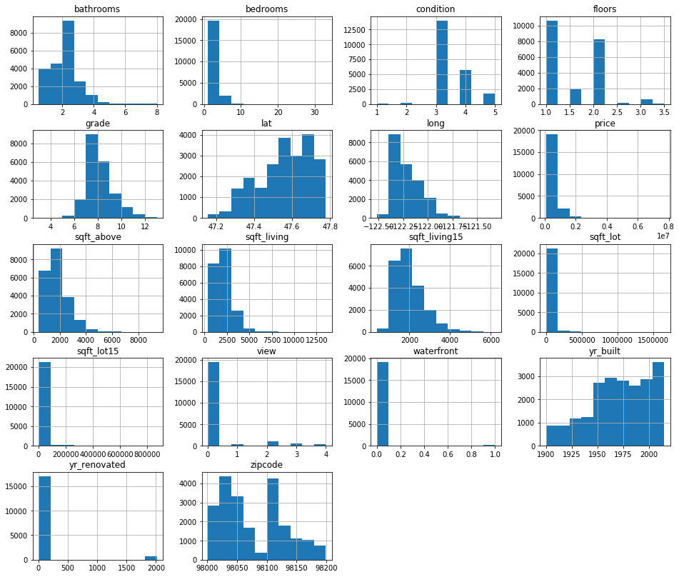


Let's also take a look at scatter plots for each numeric variable. Coincidentally, the scatter matrix below will let us do an initial check for linear relationships between the independent variables and the target of our analysis, `price`.


```python
# Create a scatter_matrix to look for categorical variables and linear relationships
pd.plotting.scatter_matrix(data.drop(['id'], axis=1), figsize=[16,14]);
```


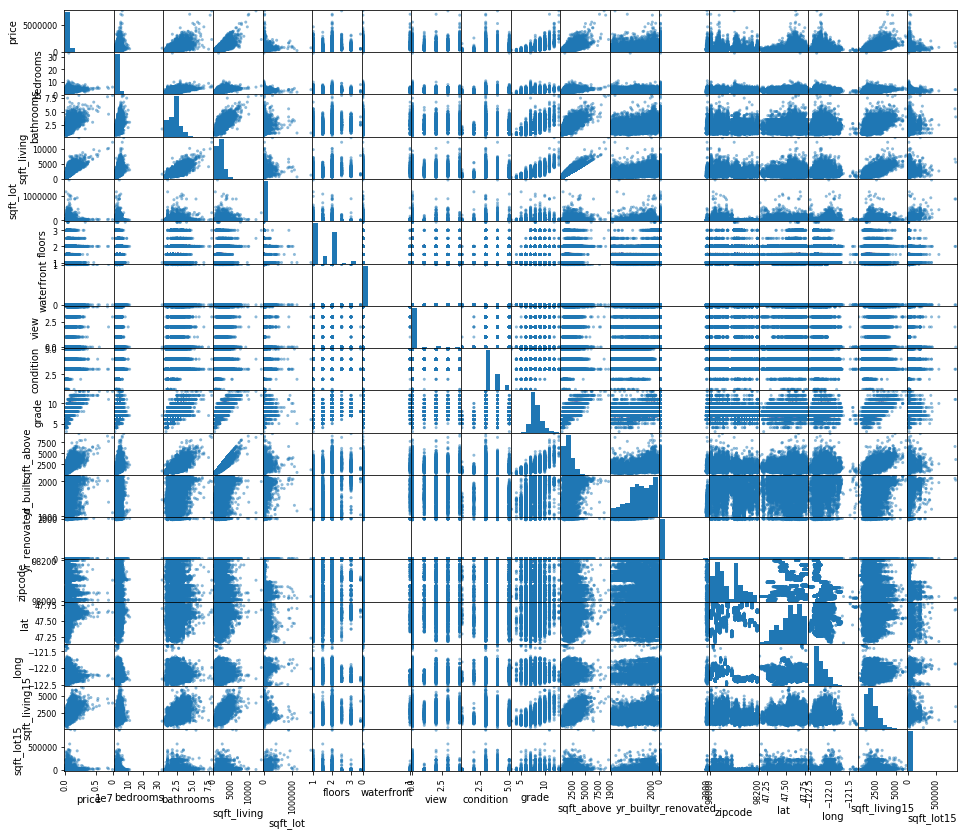


Based on the plots, value counts, and summary statistics, I think that `floors`, `waterfront`, `view`, `condition`,  and `grade` may all be candidates for one-hot encoding in the final dataset. There is also `zipcode` to consider; although there are many unique values in that column, a home's zipcode is more like a category it belongs to than a quantitative measure of some kind. 

I choose to continue to treat all variables as continuous for the first round of modeling, but below I will create a copy of my dataset with `zipcode` one-hot encoded to try as well.

## Are any of the independent variables strongly correlated with each other?

Multicollinearity (when two or more independent variables are strongly correlated with each other) can cause a model to appear better than it really is; those correlations amplify the effects of the correlated features. If such correlations are found, one variable from each correlated pair can be dropped from the model to counteract the effect of multicollinearity.

I will check for correlations among the features using a correlation matrix and a heatmap, below, and using 0.8 as the threshold for "strong" correlation.


```python
# Create a boolean correlation matrix to highlight strong correlations
abs(data.corr()) > 0.8
```


<div>
<style scoped>
    .dataframe tbody tr th:only-of-type {
        vertical-align: middle;
    }

    .dataframe tbody tr th {
        vertical-align: top;
    }

    .dataframe thead th {
        text-align: right;
    }
</style>
<table border="1" class="dataframe">
  <thead>
    <tr style="text-align: right;">
      <th></th>
      <th>id</th>
      <th>price</th>
      <th>bedrooms</th>
      <th>bathrooms</th>
      <th>sqft_living</th>
      <th>sqft_lot</th>
      <th>floors</th>
      <th>waterfront</th>
      <th>view</th>
      <th>condition</th>
      <th>grade</th>
      <th>sqft_above</th>
      <th>yr_built</th>
      <th>yr_renovated</th>
      <th>zipcode</th>
      <th>lat</th>
      <th>long</th>
      <th>sqft_living15</th>
      <th>sqft_lot15</th>
    </tr>
  </thead>
  <tbody>
    <tr>
      <th>id</th>
      <td>True</td>
      <td>False</td>
      <td>False</td>
      <td>False</td>
      <td>False</td>
      <td>False</td>
      <td>False</td>
      <td>False</td>
      <td>False</td>
      <td>False</td>
      <td>False</td>
      <td>False</td>
      <td>False</td>
      <td>False</td>
      <td>False</td>
      <td>False</td>
      <td>False</td>
      <td>False</td>
      <td>False</td>
    </tr>
    <tr>
      <th>price</th>
      <td>False</td>
      <td>True</td>
      <td>False</td>
      <td>False</td>
      <td>False</td>
      <td>False</td>
      <td>False</td>
      <td>False</td>
      <td>False</td>
      <td>False</td>
      <td>False</td>
      <td>False</td>
      <td>False</td>
      <td>False</td>
      <td>False</td>
      <td>False</td>
      <td>False</td>
      <td>False</td>
      <td>False</td>
    </tr>
    <tr>
      <th>bedrooms</th>
      <td>False</td>
      <td>False</td>
      <td>True</td>
      <td>False</td>
      <td>False</td>
      <td>False</td>
      <td>False</td>
      <td>False</td>
      <td>False</td>
      <td>False</td>
      <td>False</td>
      <td>False</td>
      <td>False</td>
      <td>False</td>
      <td>False</td>
      <td>False</td>
      <td>False</td>
      <td>False</td>
      <td>False</td>
    </tr>
    <tr>
      <th>bathrooms</th>
      <td>False</td>
      <td>False</td>
      <td>False</td>
      <td>True</td>
      <td>False</td>
      <td>False</td>
      <td>False</td>
      <td>False</td>
      <td>False</td>
      <td>False</td>
      <td>False</td>
      <td>False</td>
      <td>False</td>
      <td>False</td>
      <td>False</td>
      <td>False</td>
      <td>False</td>
      <td>False</td>
      <td>False</td>
    </tr>
    <tr>
      <th>sqft_living</th>
      <td>False</td>
      <td>False</td>
      <td>False</td>
      <td>False</td>
      <td>True</td>
      <td>False</td>
      <td>False</td>
      <td>False</td>
      <td>False</td>
      <td>False</td>
      <td>False</td>
      <td>True</td>
      <td>False</td>
      <td>False</td>
      <td>False</td>
      <td>False</td>
      <td>False</td>
      <td>False</td>
      <td>False</td>
    </tr>
    <tr>
      <th>sqft_lot</th>
      <td>False</td>
      <td>False</td>
      <td>False</td>
      <td>False</td>
      <td>False</td>
      <td>True</td>
      <td>False</td>
      <td>False</td>
      <td>False</td>
      <td>False</td>
      <td>False</td>
      <td>False</td>
      <td>False</td>
      <td>False</td>
      <td>False</td>
      <td>False</td>
      <td>False</td>
      <td>False</td>
      <td>False</td>
    </tr>
    <tr>
      <th>floors</th>
      <td>False</td>
      <td>False</td>
      <td>False</td>
      <td>False</td>
      <td>False</td>
      <td>False</td>
      <td>True</td>
      <td>False</td>
      <td>False</td>
      <td>False</td>
      <td>False</td>
      <td>False</td>
      <td>False</td>
      <td>False</td>
      <td>False</td>
      <td>False</td>
      <td>False</td>
      <td>False</td>
      <td>False</td>
    </tr>
    <tr>
      <th>waterfront</th>
      <td>False</td>
      <td>False</td>
      <td>False</td>
      <td>False</td>
      <td>False</td>
      <td>False</td>
      <td>False</td>
      <td>True</td>
      <td>False</td>
      <td>False</td>
      <td>False</td>
      <td>False</td>
      <td>False</td>
      <td>False</td>
      <td>False</td>
      <td>False</td>
      <td>False</td>
      <td>False</td>
      <td>False</td>
    </tr>
    <tr>
      <th>view</th>
      <td>False</td>
      <td>False</td>
      <td>False</td>
      <td>False</td>
      <td>False</td>
      <td>False</td>
      <td>False</td>
      <td>False</td>
      <td>True</td>
      <td>False</td>
      <td>False</td>
      <td>False</td>
      <td>False</td>
      <td>False</td>
      <td>False</td>
      <td>False</td>
      <td>False</td>
      <td>False</td>
      <td>False</td>
    </tr>
    <tr>
      <th>condition</th>
      <td>False</td>
      <td>False</td>
      <td>False</td>
      <td>False</td>
      <td>False</td>
      <td>False</td>
      <td>False</td>
      <td>False</td>
      <td>False</td>
      <td>True</td>
      <td>False</td>
      <td>False</td>
      <td>False</td>
      <td>False</td>
      <td>False</td>
      <td>False</td>
      <td>False</td>
      <td>False</td>
      <td>False</td>
    </tr>
    <tr>
      <th>grade</th>
      <td>False</td>
      <td>False</td>
      <td>False</td>
      <td>False</td>
      <td>False</td>
      <td>False</td>
      <td>False</td>
      <td>False</td>
      <td>False</td>
      <td>False</td>
      <td>True</td>
      <td>False</td>
      <td>False</td>
      <td>False</td>
      <td>False</td>
      <td>False</td>
      <td>False</td>
      <td>False</td>
      <td>False</td>
    </tr>
    <tr>
      <th>sqft_above</th>
      <td>False</td>
      <td>False</td>
      <td>False</td>
      <td>False</td>
      <td>True</td>
      <td>False</td>
      <td>False</td>
      <td>False</td>
      <td>False</td>
      <td>False</td>
      <td>False</td>
      <td>True</td>
      <td>False</td>
      <td>False</td>
      <td>False</td>
      <td>False</td>
      <td>False</td>
      <td>False</td>
      <td>False</td>
    </tr>
    <tr>
      <th>yr_built</th>
      <td>False</td>
      <td>False</td>
      <td>False</td>
      <td>False</td>
      <td>False</td>
      <td>False</td>
      <td>False</td>
      <td>False</td>
      <td>False</td>
      <td>False</td>
      <td>False</td>
      <td>False</td>
      <td>True</td>
      <td>False</td>
      <td>False</td>
      <td>False</td>
      <td>False</td>
      <td>False</td>
      <td>False</td>
    </tr>
    <tr>
      <th>yr_renovated</th>
      <td>False</td>
      <td>False</td>
      <td>False</td>
      <td>False</td>
      <td>False</td>
      <td>False</td>
      <td>False</td>
      <td>False</td>
      <td>False</td>
      <td>False</td>
      <td>False</td>
      <td>False</td>
      <td>False</td>
      <td>True</td>
      <td>False</td>
      <td>False</td>
      <td>False</td>
      <td>False</td>
      <td>False</td>
    </tr>
    <tr>
      <th>zipcode</th>
      <td>False</td>
      <td>False</td>
      <td>False</td>
      <td>False</td>
      <td>False</td>
      <td>False</td>
      <td>False</td>
      <td>False</td>
      <td>False</td>
      <td>False</td>
      <td>False</td>
      <td>False</td>
      <td>False</td>
      <td>False</td>
      <td>True</td>
      <td>False</td>
      <td>False</td>
      <td>False</td>
      <td>False</td>
    </tr>
    <tr>
      <th>lat</th>
      <td>False</td>
      <td>False</td>
      <td>False</td>
      <td>False</td>
      <td>False</td>
      <td>False</td>
      <td>False</td>
      <td>False</td>
      <td>False</td>
      <td>False</td>
      <td>False</td>
      <td>False</td>
      <td>False</td>
      <td>False</td>
      <td>False</td>
      <td>True</td>
      <td>False</td>
      <td>False</td>
      <td>False</td>
    </tr>
    <tr>
      <th>long</th>
      <td>False</td>
      <td>False</td>
      <td>False</td>
      <td>False</td>
      <td>False</td>
      <td>False</td>
      <td>False</td>
      <td>False</td>
      <td>False</td>
      <td>False</td>
      <td>False</td>
      <td>False</td>
      <td>False</td>
      <td>False</td>
      <td>False</td>
      <td>False</td>
      <td>True</td>
      <td>False</td>
      <td>False</td>
    </tr>
    <tr>
      <th>sqft_living15</th>
      <td>False</td>
      <td>False</td>
      <td>False</td>
      <td>False</td>
      <td>False</td>
      <td>False</td>
      <td>False</td>
      <td>False</td>
      <td>False</td>
      <td>False</td>
      <td>False</td>
      <td>False</td>
      <td>False</td>
      <td>False</td>
      <td>False</td>
      <td>False</td>
      <td>False</td>
      <td>True</td>
      <td>False</td>
    </tr>
    <tr>
      <th>sqft_lot15</th>
      <td>False</td>
      <td>False</td>
      <td>False</td>
      <td>False</td>
      <td>False</td>
      <td>False</td>
      <td>False</td>
      <td>False</td>
      <td>False</td>
      <td>False</td>
      <td>False</td>
      <td>False</td>
      <td>False</td>
      <td>False</td>
      <td>False</td>
      <td>False</td>
      <td>False</td>
      <td>False</td>
      <td>True</td>
    </tr>
  </tbody>
</table>
</div>


```python
# Create the correlation heatmap
data_for_scatter_matrix = data.drop(['price', 'id'], axis=1)

plt.figure(figsize=(16,10))
sns.heatmap(data_for_scatter_matrix.corr(), center=0)
plt.title('Heatmap showing correlations between independent variables', fontsize=14)
plt.show();
```


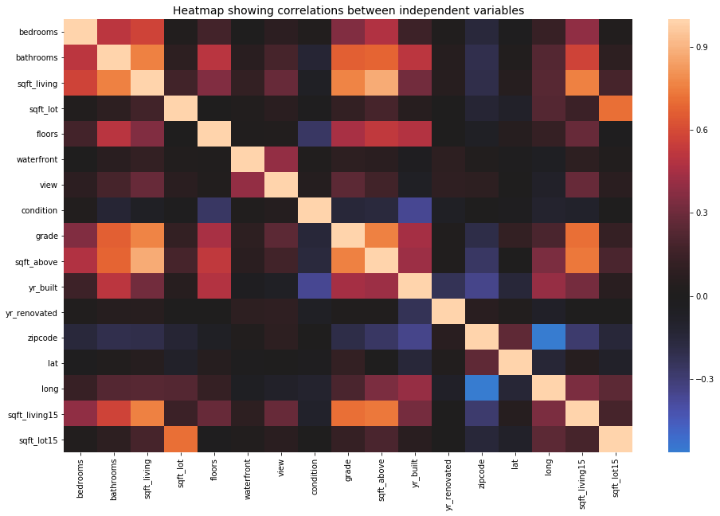


The only pair of features with a correlation coefficient of 0.8 or above is `sqft_living` and `sqft_above`. As stated earlier, `sqft_living` is the sum of `sqft_above` and `sqft_basement`, so `sqft_above` will be dropped from the dataset anyway, avoiding any potential effects caused by multicollinearity.

# Initial cleaning

Now that we have seen the basic characteristics of the whole dataset, it is time to trim it down to the part that is most relevant to middle-income families: houses with 2 to 5 bedrooms and _not_ in the top 10\% by price. This is also the time to resolve any missing values, drop unneeded columns, and then reexamine the data visually to understand the characteristics of our more focused dataset.

These are the main cleaning steps I will take:
* Filter the dataset to observations with 2-5 bedrooms.
* Filter the dataset to observations with price below the 90th percentile.
* Resolve missing values in the `waterfront`, `view`, and `yr_renovated` columns.
* Calculate a new column, `month`, from the date column.
* Drop the following columns: `id`, `date`, `sqft_above`, `sqft_basement`.

### Filter to focus on midrange homes

First, let's focus in on the midrange homes by filtering out the biggest and most expensive ones.


```python
# Filter the dataset
midrange_homes = data[(data['price'] < np.quantile(data['price'], 0.9)) 
                         & (data['bedrooms'].isin(range(2, 6)))]

# View the first few rows
midrange_homes.head()
```


<div>
<style scoped>
    .dataframe tbody tr th:only-of-type {
        vertical-align: middle;
    }

    .dataframe tbody tr th {
        vertical-align: top;
    }

    .dataframe thead th {
        text-align: right;
    }
</style>
<table border="1" class="dataframe">
  <thead>
    <tr style="text-align: right;">
      <th></th>
      <th>id</th>
      <th>date</th>
      <th>price</th>
      <th>bedrooms</th>
      <th>bathrooms</th>
      <th>sqft_living</th>
      <th>sqft_lot</th>
      <th>floors</th>
      <th>waterfront</th>
      <th>view</th>
      <th>...</th>
      <th>grade</th>
      <th>sqft_above</th>
      <th>sqft_basement</th>
      <th>yr_built</th>
      <th>yr_renovated</th>
      <th>zipcode</th>
      <th>lat</th>
      <th>long</th>
      <th>sqft_living15</th>
      <th>sqft_lot15</th>
    </tr>
  </thead>
  <tbody>
    <tr>
      <th>0</th>
      <td>7129300520</td>
      <td>10/13/2014</td>
      <td>221900.0</td>
      <td>3</td>
      <td>1.00</td>
      <td>1180</td>
      <td>5650</td>
      <td>1.0</td>
      <td>NaN</td>
      <td>0.0</td>
      <td>...</td>
      <td>7</td>
      <td>1180</td>
      <td>0.0</td>
      <td>1955</td>
      <td>0.0</td>
      <td>98178</td>
      <td>47.5112</td>
      <td>-122.257</td>
      <td>1340</td>
      <td>5650</td>
    </tr>
    <tr>
      <th>1</th>
      <td>6414100192</td>
      <td>12/9/2014</td>
      <td>538000.0</td>
      <td>3</td>
      <td>2.25</td>
      <td>2570</td>
      <td>7242</td>
      <td>2.0</td>
      <td>0.0</td>
      <td>0.0</td>
      <td>...</td>
      <td>7</td>
      <td>2170</td>
      <td>400.0</td>
      <td>1951</td>
      <td>1991.0</td>
      <td>98125</td>
      <td>47.7210</td>
      <td>-122.319</td>
      <td>1690</td>
      <td>7639</td>
    </tr>
    <tr>
      <th>2</th>
      <td>5631500400</td>
      <td>2/25/2015</td>
      <td>180000.0</td>
      <td>2</td>
      <td>1.00</td>
      <td>770</td>
      <td>10000</td>
      <td>1.0</td>
      <td>0.0</td>
      <td>0.0</td>
      <td>...</td>
      <td>6</td>
      <td>770</td>
      <td>0.0</td>
      <td>1933</td>
      <td>NaN</td>
      <td>98028</td>
      <td>47.7379</td>
      <td>-122.233</td>
      <td>2720</td>
      <td>8062</td>
    </tr>
    <tr>
      <th>3</th>
      <td>2487200875</td>
      <td>12/9/2014</td>
      <td>604000.0</td>
      <td>4</td>
      <td>3.00</td>
      <td>1960</td>
      <td>5000</td>
      <td>1.0</td>
      <td>0.0</td>
      <td>0.0</td>
      <td>...</td>
      <td>7</td>
      <td>1050</td>
      <td>910.0</td>
      <td>1965</td>
      <td>0.0</td>
      <td>98136</td>
      <td>47.5208</td>
      <td>-122.393</td>
      <td>1360</td>
      <td>5000</td>
    </tr>
    <tr>
      <th>4</th>
      <td>1954400510</td>
      <td>2/18/2015</td>
      <td>510000.0</td>
      <td>3</td>
      <td>2.00</td>
      <td>1680</td>
      <td>8080</td>
      <td>1.0</td>
      <td>0.0</td>
      <td>0.0</td>
      <td>...</td>
      <td>8</td>
      <td>1680</td>
      <td>0.0</td>
      <td>1987</td>
      <td>0.0</td>
      <td>98074</td>
      <td>47.6168</td>
      <td>-122.045</td>
      <td>1800</td>
      <td>7503</td>
    </tr>
  </tbody>
</table>
<p>5 rows × 21 columns</p>
</div>


Let's check the effect of our filtering by looking at the summary statistics again:


```python
# View summary statistics
midrange_homes.describe()
```


<div>
<style scoped>
    .dataframe tbody tr th:only-of-type {
        vertical-align: middle;
    }

    .dataframe tbody tr th {
        vertical-align: top;
    }

    .dataframe thead th {
        text-align: right;
    }
</style>
<table border="1" class="dataframe">
  <thead>
    <tr style="text-align: right;">
      <th></th>
      <th>id</th>
      <th>price</th>
      <th>bedrooms</th>
      <th>bathrooms</th>
      <th>sqft_living</th>
      <th>sqft_lot</th>
      <th>floors</th>
      <th>waterfront</th>
      <th>view</th>
      <th>condition</th>
      <th>grade</th>
      <th>sqft_above</th>
      <th>yr_built</th>
      <th>yr_renovated</th>
      <th>zipcode</th>
      <th>lat</th>
      <th>long</th>
      <th>sqft_living15</th>
      <th>sqft_lot15</th>
    </tr>
  </thead>
  <tbody>
    <tr>
      <th>count</th>
      <td>1.899900e+04</td>
      <td>18999.000000</td>
      <td>18999.000000</td>
      <td>18999.000000</td>
      <td>18999.000000</td>
      <td>1.899900e+04</td>
      <td>18999.000000</td>
      <td>16906.000000</td>
      <td>18943.000000</td>
      <td>18999.000000</td>
      <td>18999.000000</td>
      <td>18999.000000</td>
      <td>18999.000000</td>
      <td>15614.000000</td>
      <td>18999.000000</td>
      <td>18999.000000</td>
      <td>18999.000000</td>
      <td>18999.000000</td>
      <td>18999.000000</td>
    </tr>
    <tr>
      <th>mean</th>
      <td>4.623793e+09</td>
      <td>451033.600453</td>
      <td>3.285910</td>
      <td>2.012816</td>
      <td>1912.888047</td>
      <td>1.413348e+04</td>
      <td>1.463682</td>
      <td>0.002189</td>
      <td>0.145331</td>
      <td>3.405127</td>
      <td>7.464498</td>
      <td>1659.656298</td>
      <td>1971.048424</td>
      <td>66.947931</td>
      <td>98078.543344</td>
      <td>47.553219</td>
      <td>-122.212729</td>
      <td>1882.645929</td>
      <td>12188.540871</td>
    </tr>
    <tr>
      <th>std</th>
      <td>2.878978e+09</td>
      <td>177148.927445</td>
      <td>0.782848</td>
      <td>0.672443</td>
      <td>706.241075</td>
      <td>3.852339e+04</td>
      <td>0.536461</td>
      <td>0.046732</td>
      <td>0.582127</td>
      <td>0.643411</td>
      <td>0.959870</td>
      <td>671.456125</td>
      <td>28.847826</td>
      <td>359.290326</td>
      <td>53.294178</td>
      <td>0.143337</td>
      <td>0.142935</td>
      <td>574.261538</td>
      <td>25473.821194</td>
    </tr>
    <tr>
      <th>min</th>
      <td>1.200019e+06</td>
      <td>78000.000000</td>
      <td>2.000000</td>
      <td>0.500000</td>
      <td>440.000000</td>
      <td>5.200000e+02</td>
      <td>1.000000</td>
      <td>0.000000</td>
      <td>0.000000</td>
      <td>1.000000</td>
      <td>4.000000</td>
      <td>440.000000</td>
      <td>1900.000000</td>
      <td>0.000000</td>
      <td>98001.000000</td>
      <td>47.155900</td>
      <td>-122.519000</td>
      <td>399.000000</td>
      <td>651.000000</td>
    </tr>
    <tr>
      <th>25%</th>
      <td>2.154950e+09</td>
      <td>310000.000000</td>
      <td>3.000000</td>
      <td>1.500000</td>
      <td>1380.000000</td>
      <td>5.000000e+03</td>
      <td>1.000000</td>
      <td>0.000000</td>
      <td>0.000000</td>
      <td>3.000000</td>
      <td>7.000000</td>
      <td>1160.000000</td>
      <td>1952.000000</td>
      <td>0.000000</td>
      <td>98033.000000</td>
      <td>47.451150</td>
      <td>-122.330000</td>
      <td>1460.000000</td>
      <td>5040.000000</td>
    </tr>
    <tr>
      <th>50%</th>
      <td>3.943600e+09</td>
      <td>425000.000000</td>
      <td>3.000000</td>
      <td>2.000000</td>
      <td>1810.000000</td>
      <td>7.486000e+03</td>
      <td>1.000000</td>
      <td>0.000000</td>
      <td>0.000000</td>
      <td>3.000000</td>
      <td>7.000000</td>
      <td>1480.000000</td>
      <td>1975.000000</td>
      <td>0.000000</td>
      <td>98065.000000</td>
      <td>47.562200</td>
      <td>-122.233000</td>
      <td>1780.000000</td>
      <td>7515.000000</td>
    </tr>
    <tr>
      <th>75%</th>
      <td>7.350400e+09</td>
      <td>570000.000000</td>
      <td>4.000000</td>
      <td>2.500000</td>
      <td>2340.000000</td>
      <td>1.015000e+04</td>
      <td>2.000000</td>
      <td>0.000000</td>
      <td>0.000000</td>
      <td>4.000000</td>
      <td>8.000000</td>
      <td>2030.000000</td>
      <td>1996.000000</td>
      <td>0.000000</td>
      <td>98118.000000</td>
      <td>47.680700</td>
      <td>-122.122000</td>
      <td>2230.000000</td>
      <td>9750.000000</td>
    </tr>
    <tr>
      <th>max</th>
      <td>9.900000e+09</td>
      <td>886000.000000</td>
      <td>5.000000</td>
      <td>5.000000</td>
      <td>5820.000000</td>
      <td>1.651359e+06</td>
      <td>3.500000</td>
      <td>1.000000</td>
      <td>4.000000</td>
      <td>5.000000</td>
      <td>12.000000</td>
      <td>5450.000000</td>
      <td>2015.000000</td>
      <td>2015.000000</td>
      <td>98199.000000</td>
      <td>47.777600</td>
      <td>-121.315000</td>
      <td>4670.000000</td>
      <td>560617.000000</td>
    </tr>
  </tbody>
</table>
</div>


Bedrooms now range from 2 to 5, and the median price is now \$425,000.

Let's check again for missing values; some may have been eliminated by the filtering.


```python
# Check for missing values by column
midrange_homes.isna().sum()
```


    id                  0  
    date                0  
    price               0  
    bedrooms            0  
    bathrooms           0  
    sqft_living         0  
    sqft_lot            0  
    floors              0  
    waterfront       2093  
    view               56  
    condition           0  
    grade               0  
    sqft_above          0  
    sqft_basement       0  
    yr_built            0  
    yr_renovated     3385  
    zipcode             0  
    lat                 0  
    long                0  
    sqft_living15       0  
    sqft_lot15          0  
    dtype: int64


### Resolve missing values

#### `waterfront`

I can see above that there are still 2,093 missing values in the `waterfront` column. I'll investigate further.


```python
# View value counts for 'waterfront'
midrange_homes['waterfront'].value_counts()
```


    0.0    16869  
    1.0       37  
    Name: waterfront, dtype: int64


Out of about 19,000 observations, only 37 have a value of 1 (presumably meaning "yes") in the `waterfront` column. If we take a quick look at median prices of homes with `waterfront == 1` versus those where it equals 0...


```python
# Print medians of homes with and without 'waterfront'
print(midrange_homes[midrange_homes['waterfront'] == 1]['price'].median())
print(midrange_homes[midrange_homes['waterfront'] == 0]['price'].median())
```

    635000.0
    
    425000.0


...it is clear that waterfront probably has a pretty strong effect on price, but the vast majority of houses are not experiencing this effect. For this reason, I will fill missing `waterfront` values with 0, assuming that when the creators of this dataset left a value blank, the property was probably not on the waterfront anyway.


```python
# Fill NaNs with 0.0 because it is the mode
midrange_homes['waterfront'] = midrange_homes['waterfront'].fillna(0.0)
midrange_homes['waterfront'] = midrange_homes['waterfront'].astype('int64')
midrange_homes.info()
```

    <class 'pandas.core.frame.DataFrame'>  
    Int64Index: 18999 entries, 0 to 21596  
    Data columns (total 21 columns):  
    id               18999 non-null int64  
    date             18999 non-null object  
    price            18999 non-null float64  
    bedrooms         18999 non-null int64  
    bathrooms        18999 non-null float64  
    sqft_living      18999 non-null int64  
    sqft_lot         18999 non-null int64  
    floors           18999 non-null float64  
    waterfront       18999 non-null int64  
    view             18943 non-null float64  
    condition        18999 non-null int64  
    grade            18999 non-null int64  
    sqft_above       18999 non-null int64  
    sqft_basement    18999 non-null object  
    yr_built         18999 non-null int64  
    yr_renovated     15614 non-null float64  
    zipcode          18999 non-null int64  
    lat              18999 non-null float64  
    long             18999 non-null float64  
    sqft_living15    18999 non-null int64  
    sqft_lot15       18999 non-null int64  
    dtypes: float64(7), int64(12), object(2)  
    memory usage: 3.2+ MB


#### `view`

The documentation for this dataset is not very clear on what `view` represents. It seems likely, given what little has been said about it, that `view` gives some indication of whether or how much a home was viewed prior to sale. Because the maximum value of `view` is only 4, it seems likely that this is not an absolute count, but perhaps some kind of "index" or "tier" of how much viewing went on (i.e., a categorical variable). If we take a quick look at the distribution of values in `view`...


```python
# Create a histogram of 'view' values
plt.figure(figsize=(10,6))
midrange_homes['view'].hist()
plt.title('Histogram of \'view\' values')
plt.xlabel('\'view\' values')
plt.ylabel('Count')
plt.show();
```


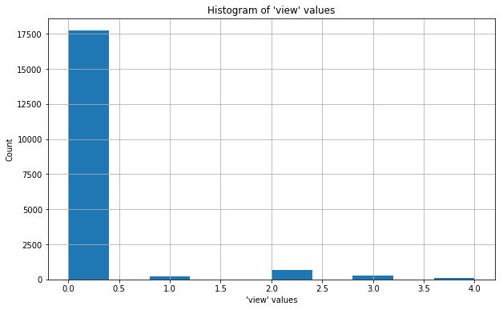


...we can see that mode of values in this column is 0 by a long shot. We can see from the summary statistics table (above) that 0 is also the minimum value, the 25th percentile, the median, and the 75% percentile. For these reasons, I will reassign all missing values to 0, since this will not change the overall distribution of the data.


```python
# Fill NaNs with 0.0 and check that missing `view` values are now resolved
midrange_homes['view'] = midrange_homes['view'].fillna(0.0).astype('int64')
midrange_homes.info()
```

    <class 'pandas.core.frame.DataFrame'>  
    Int64Index: 18999 entries, 0 to 21596  
    Data columns (total 21 columns):  
    id               18999 non-null int64  
    date             18999 non-null object  
    price            18999 non-null float64  
    bedrooms         18999 non-null int64  
    bathrooms        18999 non-null float64  
    sqft_living      18999 non-null int64  
    sqft_lot         18999 non-null int64  
    floors           18999 non-null float64  
    waterfront       18999 non-null int64  
    view             18999 non-null int64  
    condition        18999 non-null int64  
    grade            18999 non-null int64  
    sqft_above       18999 non-null int64  
    sqft_basement    18999 non-null object  
    yr_built         18999 non-null int64  
    yr_renovated     15614 non-null float64  
    zipcode          18999 non-null int64  
    lat              18999 non-null float64  
    long             18999 non-null float64  
    sqft_living15    18999 non-null int64  
    sqft_lot15       18999 non-null int64  
    dtypes: float64(6), int64(13), object(2)  
    memory usage: 3.2+ MB


      


#### `yr_renovated`

From the histogram below, it is clear that most `yr_renovated` values are 0. I assume this means that a house has not had substantial renovation since its construction.


```python
# Create a histogram of 'yr_renovated' values
plt.figure(figsize=(10,6))
midrange_homes['yr_renovated'].hist()
plt.title('Histogram of \'yr_renovated\' values')
plt.xlabel('\'yr_renovated\' values')
plt.ylabel('Count')
plt.show();
```


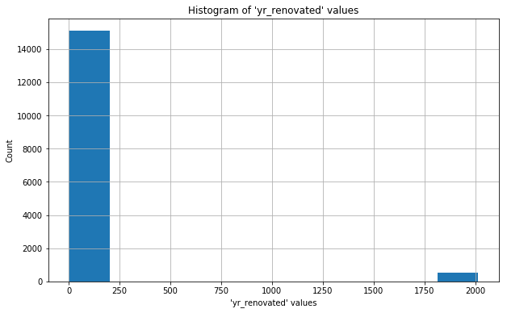


Since 0 is the mode, I will replace the missing values with 0:


```python
# Fill NaNs with 0 and cast to dtype 'int64'
midrange_homes['yr_renovated'] = midrange_homes['yr_renovated'].fillna(0)
midrange_homes['yr_renovated'] = midrange_homes['yr_renovated'].astype('int64')

# Confirm that all missing values have been resolved
midrange_homes.info()
```

    <class 'pandas.core.frame.DataFrame'>  
    Int64Index: 18999 entries, 0 to 21596  
    Data columns (total 21 columns):  
    id               18999 non-null int64  
    date             18999 non-null object  
    price            18999 non-null float64  
    bedrooms         18999 non-null int64  
    bathrooms        18999 non-null float64  
    sqft_living      18999 non-null int64  
    sqft_lot         18999 non-null int64  
    floors           18999 non-null float64  
    waterfront       18999 non-null int64  
    view             18999 non-null int64  
    condition        18999 non-null int64  
    grade            18999 non-null int64  
    sqft_above       18999 non-null int64  
    sqft_basement    18999 non-null object  
    yr_built         18999 non-null int64  
    yr_renovated     18999 non-null int64  
    zipcode          18999 non-null int64  
    lat              18999 non-null float64  
    long             18999 non-null float64  
    sqft_living15    18999 non-null int64  
    sqft_lot15       18999 non-null int64  
    dtypes: float64(5), int64(14), object(2)  
    memory usage: 3.2+ MB


### Create the 'month' column

I want to have the option to explore seasonality in sale prices. Since the dataset comes from 2014-2015 and I want to be able to generalize to other years, I will focus on the month in which each sale was made. I will extract the number of the month from each date into a new column.


```python
# Create 'month' column
midrange_homes['month'] = [x.split('/')[0] for x in midrange_homes['date']]
midrange_homes['month'] = pd.to_numeric(midrange_homes['month'], 
                                        errors='coerce')

# Confirm that 'month' exists and is numeric
midrange_homes.info()
```

    <class 'pandas.core.frame.DataFrame'>  
    Int64Index: 18999 entries, 0 to 21596  
    Data columns (total 22 columns):  
    id               18999 non-null int64  
    date             18999 non-null object  
    price            18999 non-null float64  
    bedrooms         18999 non-null int64  
    bathrooms        18999 non-null float64  
    sqft_living      18999 non-null int64  
    sqft_lot         18999 non-null int64  
    floors           18999 non-null float64  
    waterfront       18999 non-null int64  
    view             18999 non-null int64  
    condition        18999 non-null int64  
    grade            18999 non-null int64  
    sqft_above       18999 non-null int64  
    sqft_basement    18999 non-null object  
    yr_built         18999 non-null int64  
    yr_renovated     18999 non-null int64  
    zipcode          18999 non-null int64  
    lat              18999 non-null float64  
    long             18999 non-null float64  
    sqft_living15    18999 non-null int64  
    sqft_lot15       18999 non-null int64  
    month            18999 non-null int64  
    dtypes: float64(5), int64(15), object(2)  
    memory usage: 3.3+ MB


### Drop unneeded columns

I have decided to drop the following columns for the reasons given below:

* `id`: The values in this column simply identify each observation, and I don't expect them to be useful for modeling.

* `date`: The whole date is not analytically interesting to me, but the month is, so I extracted that data to a separate column.

* `sqft_above` and `sqft_basement`: As stated above, `sqft_living` appears to be the sum of these two values. Since there is not much a homeowner could do to shift the balance of 'above' space to basement, I don't expect these features to be useful for my model.


```python
# Drop unneeded columns
midrange_homes.drop(['id', 'date', 'sqft_above', 'sqft_basement'], 
                    axis=1, inplace=True)

# Review the remaining columns
midrange_homes.info()
```

    <class 'pandas.core.frame.DataFrame'>  
    Int64Index: 18999 entries, 0 to 21596  
    Data columns (total 18 columns):  
    price            18999 non-null float64  
    bedrooms         18999 non-null int64  
    bathrooms        18999 non-null float64  
    sqft_living      18999 non-null int64  
    sqft_lot         18999 non-null int64  
    floors           18999 non-null float64  
    waterfront       18999 non-null int64  
    view             18999 non-null int64  
    condition        18999 non-null int64  
    grade            18999 non-null int64  
    yr_built         18999 non-null int64  
    yr_renovated     18999 non-null int64  
    zipcode          18999 non-null int64  
    lat              18999 non-null float64  
    long             18999 non-null float64  
    sqft_living15    18999 non-null int64  
    sqft_lot15       18999 non-null int64  
    month            18999 non-null int64  
    dtypes: float64(5), int64(13)  
    memory usage: 2.8 MB


A look at the `.info()` above shows that we now have 18,999 rows and 18 columns. All columns are of numeric data types, and there are no missing values.

# Exploring just the midrange homes

## General exploration

Let's revisit our histograms now that the data has been cleaned.


```python
# Create histograms of numeric features
hist_it(midrange_homes)
```


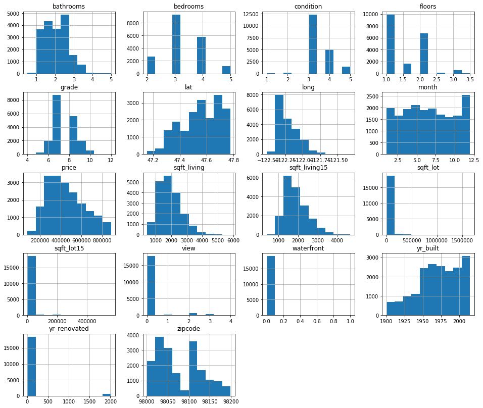


Note that selecting the homes with lower prices and 2-5 bedrooms has also caused the ranges of some other variables to shrink. `grade`, for instance, now only goes up to 10, `sqft_living` to about 5,000, and `bathrooms` up to 5. 

Now let's examine scatterplots of each feature against price:


```python
# Create scatterplots of all columns v. price
for column in midrange_homes.drop('price', axis=1):
    midrange_homes.plot(kind='scatter', x=column, y='price', alpha=0.3)
    plt.show();
```


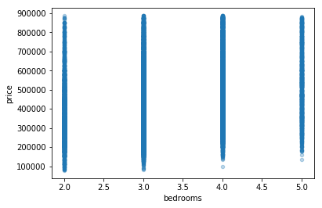


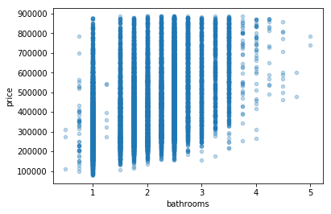


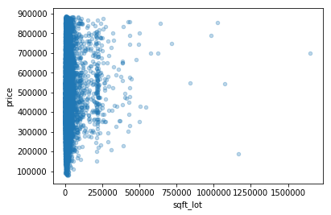


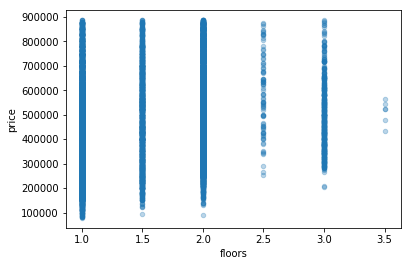


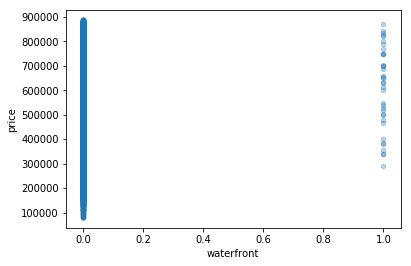


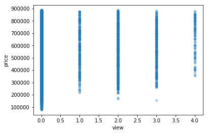


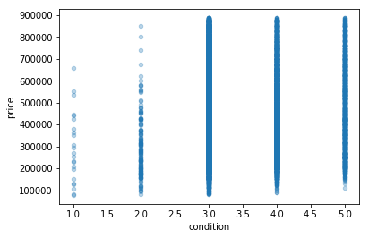


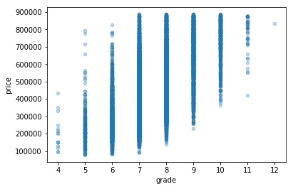


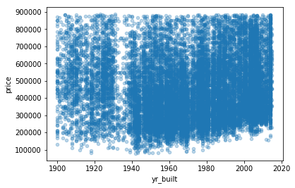


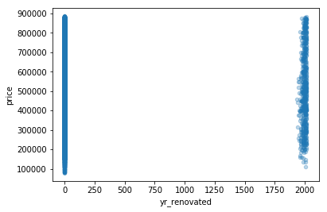


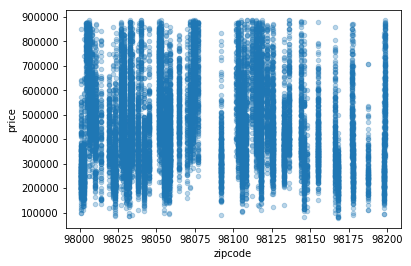


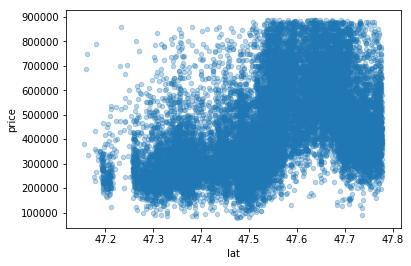


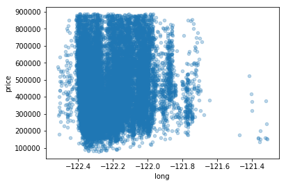


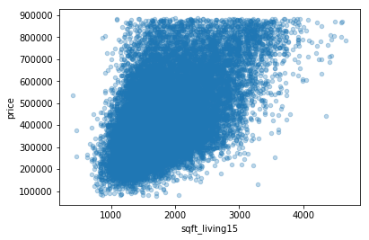


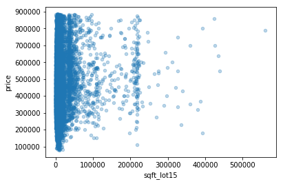


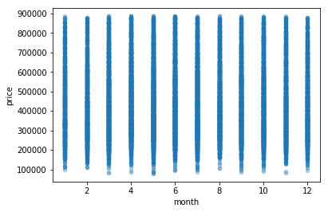


Most features appear to have a more or less linear relationship with price. The distribution of points in `zipcode` makes me wonder if there are actually two subsets in this data: homes in the Seattle area (with zipcodes of 98100 and up), and homes elsewhere in the county. Depending on the results of my first attempt at modeling, I may decide to reexamine the effect that location may be having on the model.

Now that the dataset has been trimmed down a bit, let's re-check for multicollinearity.


```python
# Create a boolean correlation matrix to highlight strong correlations
abs(midrange_homes.corr()) > 0.8
```


<div>
<style scoped>
    .dataframe tbody tr th:only-of-type {
        vertical-align: middle;
    }

    .dataframe tbody tr th {
        vertical-align: top;
    }

    .dataframe thead th {
        text-align: right;
    }
</style>
<table border="1" class="dataframe">
  <thead>
    <tr style="text-align: right;">
      <th></th>
      <th>price</th>
      <th>bedrooms</th>
      <th>bathrooms</th>
      <th>sqft_living</th>
      <th>sqft_lot</th>
      <th>floors</th>
      <th>waterfront</th>
      <th>view</th>
      <th>condition</th>
      <th>grade</th>
      <th>yr_built</th>
      <th>yr_renovated</th>
      <th>zipcode</th>
      <th>lat</th>
      <th>long</th>
      <th>sqft_living15</th>
      <th>sqft_lot15</th>
      <th>month</th>
    </tr>
  </thead>
  <tbody>
    <tr>
      <th>price</th>
      <td>True</td>
      <td>False</td>
      <td>False</td>
      <td>False</td>
      <td>False</td>
      <td>False</td>
      <td>False</td>
      <td>False</td>
      <td>False</td>
      <td>False</td>
      <td>False</td>
      <td>False</td>
      <td>False</td>
      <td>False</td>
      <td>False</td>
      <td>False</td>
      <td>False</td>
      <td>False</td>
    </tr>
    <tr>
      <th>bedrooms</th>
      <td>False</td>
      <td>True</td>
      <td>False</td>
      <td>False</td>
      <td>False</td>
      <td>False</td>
      <td>False</td>
      <td>False</td>
      <td>False</td>
      <td>False</td>
      <td>False</td>
      <td>False</td>
      <td>False</td>
      <td>False</td>
      <td>False</td>
      <td>False</td>
      <td>False</td>
      <td>False</td>
    </tr>
    <tr>
      <th>bathrooms</th>
      <td>False</td>
      <td>False</td>
      <td>True</td>
      <td>False</td>
      <td>False</td>
      <td>False</td>
      <td>False</td>
      <td>False</td>
      <td>False</td>
      <td>False</td>
      <td>False</td>
      <td>False</td>
      <td>False</td>
      <td>False</td>
      <td>False</td>
      <td>False</td>
      <td>False</td>
      <td>False</td>
    </tr>
    <tr>
      <th>sqft_living</th>
      <td>False</td>
      <td>False</td>
      <td>False</td>
      <td>True</td>
      <td>False</td>
      <td>False</td>
      <td>False</td>
      <td>False</td>
      <td>False</td>
      <td>False</td>
      <td>False</td>
      <td>False</td>
      <td>False</td>
      <td>False</td>
      <td>False</td>
      <td>False</td>
      <td>False</td>
      <td>False</td>
    </tr>
    <tr>
      <th>sqft_lot</th>
      <td>False</td>
      <td>False</td>
      <td>False</td>
      <td>False</td>
      <td>True</td>
      <td>False</td>
      <td>False</td>
      <td>False</td>
      <td>False</td>
      <td>False</td>
      <td>False</td>
      <td>False</td>
      <td>False</td>
      <td>False</td>
      <td>False</td>
      <td>False</td>
      <td>False</td>
      <td>False</td>
    </tr>
    <tr>
      <th>floors</th>
      <td>False</td>
      <td>False</td>
      <td>False</td>
      <td>False</td>
      <td>False</td>
      <td>True</td>
      <td>False</td>
      <td>False</td>
      <td>False</td>
      <td>False</td>
      <td>False</td>
      <td>False</td>
      <td>False</td>
      <td>False</td>
      <td>False</td>
      <td>False</td>
      <td>False</td>
      <td>False</td>
    </tr>
    <tr>
      <th>waterfront</th>
      <td>False</td>
      <td>False</td>
      <td>False</td>
      <td>False</td>
      <td>False</td>
      <td>False</td>
      <td>True</td>
      <td>False</td>
      <td>False</td>
      <td>False</td>
      <td>False</td>
      <td>False</td>
      <td>False</td>
      <td>False</td>
      <td>False</td>
      <td>False</td>
      <td>False</td>
      <td>False</td>
    </tr>
    <tr>
      <th>view</th>
      <td>False</td>
      <td>False</td>
      <td>False</td>
      <td>False</td>
      <td>False</td>
      <td>False</td>
      <td>False</td>
      <td>True</td>
      <td>False</td>
      <td>False</td>
      <td>False</td>
      <td>False</td>
      <td>False</td>
      <td>False</td>
      <td>False</td>
      <td>False</td>
      <td>False</td>
      <td>False</td>
    </tr>
    <tr>
      <th>condition</th>
      <td>False</td>
      <td>False</td>
      <td>False</td>
      <td>False</td>
      <td>False</td>
      <td>False</td>
      <td>False</td>
      <td>False</td>
      <td>True</td>
      <td>False</td>
      <td>False</td>
      <td>False</td>
      <td>False</td>
      <td>False</td>
      <td>False</td>
      <td>False</td>
      <td>False</td>
      <td>False</td>
    </tr>
    <tr>
      <th>grade</th>
      <td>False</td>
      <td>False</td>
      <td>False</td>
      <td>False</td>
      <td>False</td>
      <td>False</td>
      <td>False</td>
      <td>False</td>
      <td>False</td>
      <td>True</td>
      <td>False</td>
      <td>False</td>
      <td>False</td>
      <td>False</td>
      <td>False</td>
      <td>False</td>
      <td>False</td>
      <td>False</td>
    </tr>
    <tr>
      <th>yr_built</th>
      <td>False</td>
      <td>False</td>
      <td>False</td>
      <td>False</td>
      <td>False</td>
      <td>False</td>
      <td>False</td>
      <td>False</td>
      <td>False</td>
      <td>False</td>
      <td>True</td>
      <td>False</td>
      <td>False</td>
      <td>False</td>
      <td>False</td>
      <td>False</td>
      <td>False</td>
      <td>False</td>
    </tr>
    <tr>
      <th>yr_renovated</th>
      <td>False</td>
      <td>False</td>
      <td>False</td>
      <td>False</td>
      <td>False</td>
      <td>False</td>
      <td>False</td>
      <td>False</td>
      <td>False</td>
      <td>False</td>
      <td>False</td>
      <td>True</td>
      <td>False</td>
      <td>False</td>
      <td>False</td>
      <td>False</td>
      <td>False</td>
      <td>False</td>
    </tr>
    <tr>
      <th>zipcode</th>
      <td>False</td>
      <td>False</td>
      <td>False</td>
      <td>False</td>
      <td>False</td>
      <td>False</td>
      <td>False</td>
      <td>False</td>
      <td>False</td>
      <td>False</td>
      <td>False</td>
      <td>False</td>
      <td>True</td>
      <td>False</td>
      <td>False</td>
      <td>False</td>
      <td>False</td>
      <td>False</td>
    </tr>
    <tr>
      <th>lat</th>
      <td>False</td>
      <td>False</td>
      <td>False</td>
      <td>False</td>
      <td>False</td>
      <td>False</td>
      <td>False</td>
      <td>False</td>
      <td>False</td>
      <td>False</td>
      <td>False</td>
      <td>False</td>
      <td>False</td>
      <td>True</td>
      <td>False</td>
      <td>False</td>
      <td>False</td>
      <td>False</td>
    </tr>
    <tr>
      <th>long</th>
      <td>False</td>
      <td>False</td>
      <td>False</td>
      <td>False</td>
      <td>False</td>
      <td>False</td>
      <td>False</td>
      <td>False</td>
      <td>False</td>
      <td>False</td>
      <td>False</td>
      <td>False</td>
      <td>False</td>
      <td>False</td>
      <td>True</td>
      <td>False</td>
      <td>False</td>
      <td>False</td>
    </tr>
    <tr>
      <th>sqft_living15</th>
      <td>False</td>
      <td>False</td>
      <td>False</td>
      <td>False</td>
      <td>False</td>
      <td>False</td>
      <td>False</td>
      <td>False</td>
      <td>False</td>
      <td>False</td>
      <td>False</td>
      <td>False</td>
      <td>False</td>
      <td>False</td>
      <td>False</td>
      <td>True</td>
      <td>False</td>
      <td>False</td>
    </tr>
    <tr>
      <th>sqft_lot15</th>
      <td>False</td>
      <td>False</td>
      <td>False</td>
      <td>False</td>
      <td>False</td>
      <td>False</td>
      <td>False</td>
      <td>False</td>
      <td>False</td>
      <td>False</td>
      <td>False</td>
      <td>False</td>
      <td>False</td>
      <td>False</td>
      <td>False</td>
      <td>False</td>
      <td>True</td>
      <td>False</td>
    </tr>
    <tr>
      <th>month</th>
      <td>False</td>
      <td>False</td>
      <td>False</td>
      <td>False</td>
      <td>False</td>
      <td>False</td>
      <td>False</td>
      <td>False</td>
      <td>False</td>
      <td>False</td>
      <td>False</td>
      <td>False</td>
      <td>False</td>
      <td>False</td>
      <td>False</td>
      <td>False</td>
      <td>False</td>
      <td>True</td>
    </tr>
  </tbody>
</table>
</div>


```python
# Create the correlation heatmap
data_for_scatter_matrix = midrange_homes.drop(['price'], axis=1)

plt.figure(figsize=(16,10))
sns.heatmap(data_for_scatter_matrix.corr(), center=0)
plt.title('Heatmap showing correlations between independent variables', 
          fontsize=18)
plt.show();
```


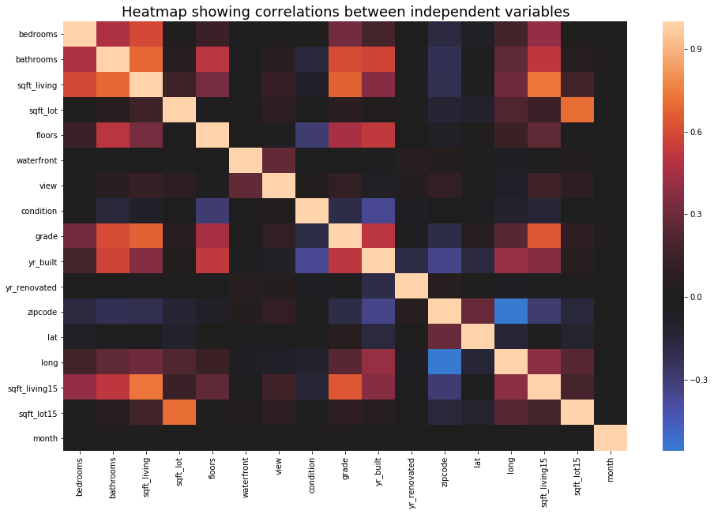


Good news: there appear to be no correlations with coefficients higher than my chosen threshold of 0.8. 

## Specific questions

Having seen the histograms and scatterplots, I now want to examine a few features in detail to answer the following questions:

* Is there a number of bedrooms that causes a big jump up in price (e.g., three versus two, or four versus three)?

* Are there times of year when prices tend to be lower or higher?

* What is the difference in price between a home of a middling grade (e.g., 7) and one of a higher grade (e.g., 10)?

### What is the relationship between bedrooms and price?

Is there a number of bedrooms that causes a big jump up in price (e.g., three versus two, or four versus three)? Let's examine some boxplots to find out.


```python
# Create boxplots for 'bedrooms' v. 'price'
plt.figure(figsize=(10,8))
sns.boxplot(midrange_homes['bedrooms'], midrange_homes['price'], color='skyblue')
plt.title('Distributions of prices for each number of bedrooms', fontsize=18)
plt.xlabel('Number of bedrooms')
plt.ylabel('Price (USD)')
plt.show();
```


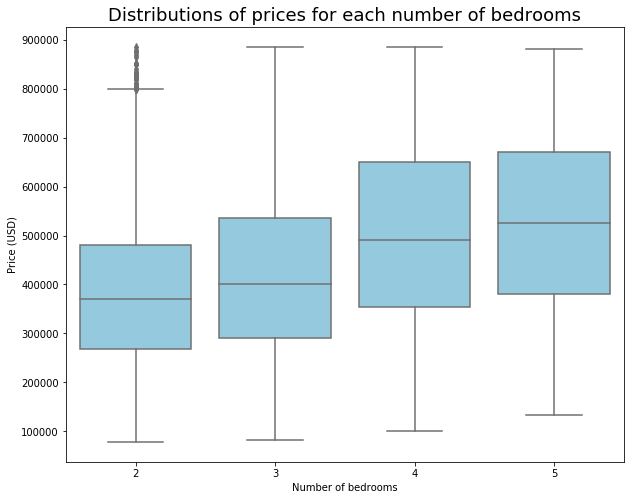


```python
# Calculate percent differences in median prices
medians = []

for n in range(2,6):
    medians.append(midrange_homes[midrange_homes['bedrooms'] == n]['price'].median())

percent_differences = []
for m in range(0,len(medians)-1):
    percent_differences.append(round(((medians[m+1] - medians[m]) / medians[m]),2))
    
percent_differences   
```


    [0.08, 0.22, 0.07]


The biggest difference in median price is between four and three bedrooms, where there is an increase of 22\%.

### Are there seasonal trends in price?

Are there times of year when prices tend to be lower or higher?


```python
# Create a boxplot to compare 'month' and 'price'
plt.figure(figsize=(10,8))
sns.boxplot(midrange_homes['month'], midrange_homes['price'], color='skyblue')
plt.title('Distributions of prices for each month', fontsize=18)
plt.xlabel('Month (January = 1)')
plt.ylabel('Price (USD)')
plt.show();
```


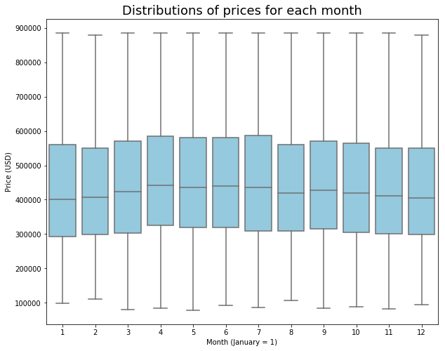


Although houses sell at a wide range of prices every month, median prices appear to be higher in April through July than in November through February.

Let's compare April and January median prices directly:


```python
april_med = midrange_homes[midrange_homes['month'] == 4]['price'].median()
january_med = midrange_homes[midrange_homes['month'] == 1]['price'].median()

april_med - january_med
```


    41000.0


There is a difference in median house price of \$41,000 between April and January! Although this analysis doesn't consider any other factors (like whether houses sold in April are bigger than those sold in January), there could be an advantage to timing the sale of one's home for the spring/summer as opposed to winter.

### What is the relationship between grade and price?

What is the difference in price between a home of a middling grade (e.g., 7) and one of a higher grade (e.g., 10)?


```python
# Create boxplots to compare 'grade' and 'price'
plt.figure(figsize=(10,8))
sns.boxplot(midrange_homes['grade'], midrange_homes['price'], color='skyblue')
plt.title('Distributions of prices for each grade', fontsize=18)
plt.xlabel('Grade')
plt.ylabel('Price (USD)')
plt.show();
```


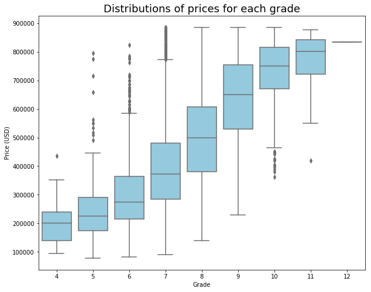


It looks like there could be substantial differences in price based on the grade of a house. For instance, only the outliers of grade-5 houses fall within the price range of grade-11 houses. 

Let's make a direct comparison between the median prices of grade-7 and grade-10 homes:


```python
grade_7_med = midrange_homes[midrange_homes['grade'] == 7]['price'].median()
grade_10_med = midrange_homes[midrange_homes['grade'] == 10]['price'].median()

grade_10_med - grade_7_med
```


    378805.0


There is a huge difference (almost \$379,000) between the median prices of grade-7 and grade-10 homes. Improving the grade of a home by that much is probably outside the reach of most homeowners. What if a homeowner could improve the grade of their home from 7 to 8?


```python
grade_8_med = midrange_homes[midrange_homes['grade'] == 8]['price'].median()

grade_8_med - grade_7_med
```


    126500.0


Based on the boxplots above, we can see that the jump in median price from grade 7 to grade 8 is a big one, but if a homeowner could manage it, it could pay off. The median price of a grade-8 home is \$126,500 higher than the median price of a grade-7 home. Again, this is without considering any other factors, like the size or condition of these homes.

### Where are the midrange homes in King County?

Because King County is home to Seattle, one of the most expensive housing markets in the US, there is probably some spatial patterning in home price, size, and quality across the county. Although a home-owning family probably cannot move their house to a new location, a family shopping for a home would want to know where they might find homes in their price range, or how much more house they could get by living a little farther from central Seattle. 

Let's use `lat` and `long` to take a look at where midrange homes can be found in King County.


```python
# Define a function to create map-like scatter plots with color code
def locate_it(data, latitude, longitude, feature):
    
    """Create a scatterplot from lat/long data with color code.
    Parameters:
        data: a DataFrame
        latitude: the name of the column in your DataFrame that contains
            the latitude values. Pass this as a string.
        longitude: the name of the column in your DataFrame that contains
            the longitude values. Pass this as a string.
        feature: the name of the column whose values you want to use as 
            the values for your color code. Pass this as a string.
    Dependencies: matplotlib
    Returns: scatterplot"""
    
    plt.figure(figsize=(16,12))
    cmap = plt.cm.get_cmap('RdYlBu')
    sc = plt.scatter(data[longitude], data[latitude], 
                     c=data[feature], vmin=min(data[feature]), 
                     vmax=max(data[feature]), alpha=0.5, s=5, cmap=cmap)
    plt.colorbar(sc)
    plt.xlabel('Longitude')
    plt.ylabel('Latitude')
    plt.title('House {} by location'.format(feature), fontsize=18)
    plt.show();
```


```python
# Call locate_it for price by location
locate_it(midrange_homes, 'lat', 'long', 'price')
```


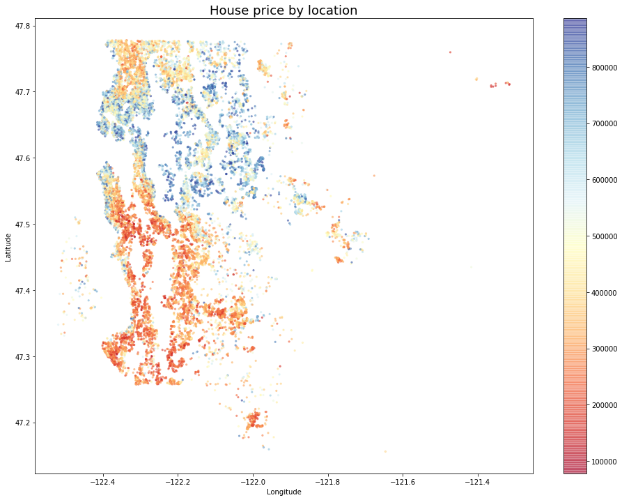


This scatterplot confirms that the most expensive midrange homes (blue dots) can be found in Seattle, around Lake Washington, and in some other waterfront locations. Less expensive homes (red dots) are concentrated in the southwest part of the county.


```python
# Call locate_it for sqft_living by location
locate_it(midrange_homes, 'lat', 'long', 'sqft_living')
```


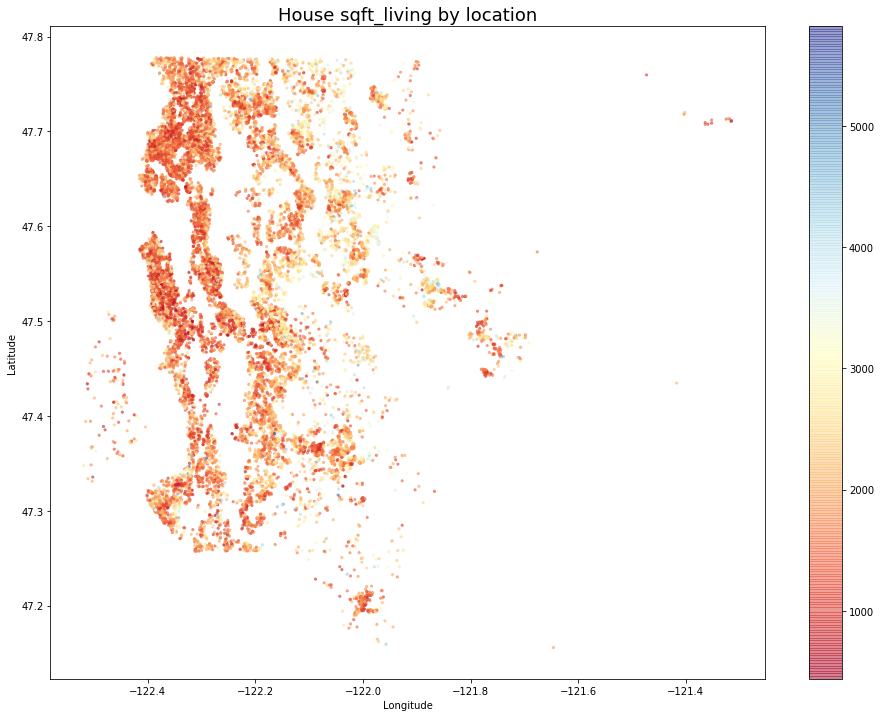


Midrange homes tend to be smaller, which is why there are so few blue dots on this plot. It's hard to understand the range of home sizes represented here, so I'll plot it again with some adjustments to the color scale.


```python
# Customize the plot for sqft_living by location
plt.figure(figsize=(16,12))
cmap = plt.cm.get_cmap('RdYlBu')
sc = plt.scatter(midrange_homes['long'], midrange_homes['lat'], 
                 c=midrange_homes['sqft_living'], 
                 vmin=min(midrange_homes['sqft_living']), 
                 vmax=np.percentile(midrange_homes['sqft_living'], 90), 
                 alpha=0.5, s=5, cmap=cmap)
plt.colorbar(sc)
plt.xlabel('Longitude')
plt.ylabel('Latitude')
plt.title('House square footage by location\n(Darkest blue = 90th percentile of size)', fontsize=14)
plt.show();
```


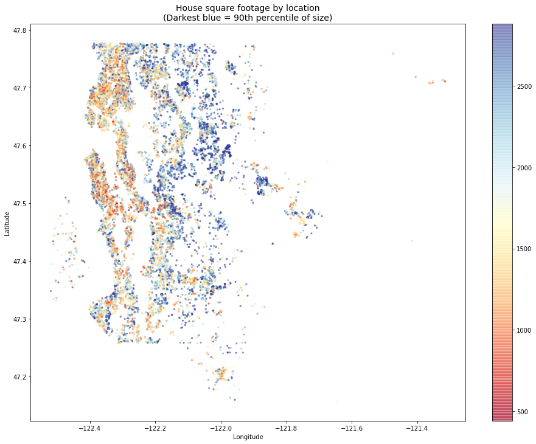


That's a little easier to understand. Midrange homes over 2,000 square feet can be found across much of western King County _except_ in Seattle proper, where they are less common.

What about house quality? Let's visualize homes by grade.


```python
# Call locate_it for grade by location
locate_it(midrange_homes, 'lat', 'long', 'grade')
```


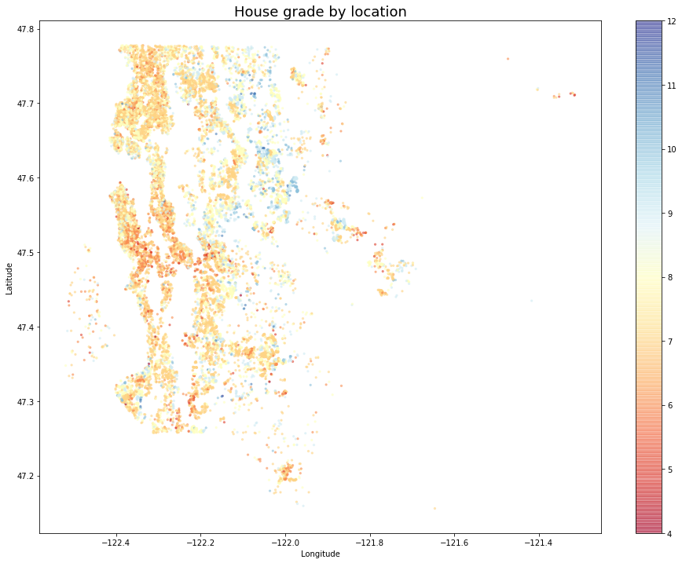


This plot shows that the highest quality midrange homes by grade can be found to the east of Lake Washington, while there seem to be more low-quality homes in the central and southwestern parts of the county. Overall, midrange homes tend to have grades in the middle of the range of possible values, from 6 to 10. 

Finally, let's look at the condition of midrange homes.


```python
locate_it(midrange_homes, 'lat', 'long', 'condition')
```


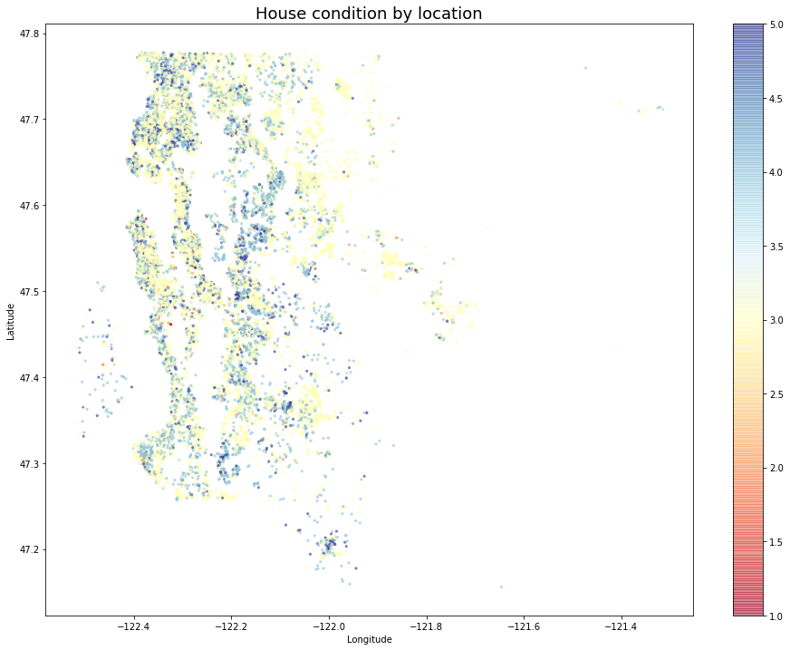


This plot contains some good news for middle-income home buyers: homes in good condition (blue dots) can be found all over King County, and midrange homes are almost all of middling condition or better. 

# Final preprocessing

I anticipate that I may want to examine the effect that location (expressed through `zipcode`) has on price, so I'll create a copy of my `midrange_homes` DataFrame with dummy variables for the various zipcodes.


```python
# Generate dummy variables
zip_dummies = pd.get_dummies(midrange_homes['zipcode'], prefix='zip')
```


```python
# Drop the original 'zipcode' column
mh_no_zips = midrange_homes.drop('zipcode', axis=1)

# Concatenate the dummies to the copy of 'midrange_homes'
mh_zips_encoded = pd.concat([mh_no_zips, zip_dummies], axis=1)

# Preview the new DataFrame
mh_zips_encoded.head()
```


<div>
<style scoped>
    .dataframe tbody tr th:only-of-type {
        vertical-align: middle;
    }

    .dataframe tbody tr th {
        vertical-align: top;
    }

    .dataframe thead th {
        text-align: right;
    }
</style>
<table border="1" class="dataframe">
  <thead>
    <tr style="text-align: right;">
      <th></th>
      <th>price</th>
      <th>bedrooms</th>
      <th>bathrooms</th>
      <th>sqft_living</th>
      <th>sqft_lot</th>
      <th>floors</th>
      <th>waterfront</th>
      <th>view</th>
      <th>condition</th>
      <th>grade</th>
      <th>...</th>
      <th>zip_98146</th>
      <th>zip_98148</th>
      <th>zip_98155</th>
      <th>zip_98166</th>
      <th>zip_98168</th>
      <th>zip_98177</th>
      <th>zip_98178</th>
      <th>zip_98188</th>
      <th>zip_98198</th>
      <th>zip_98199</th>
    </tr>
  </thead>
  <tbody>
    <tr>
      <th>0</th>
      <td>221900.0</td>
      <td>3</td>
      <td>1.00</td>
      <td>1180</td>
      <td>5650</td>
      <td>1.0</td>
      <td>0</td>
      <td>0</td>
      <td>3</td>
      <td>7</td>
      <td>...</td>
      <td>0</td>
      <td>0</td>
      <td>0</td>
      <td>0</td>
      <td>0</td>
      <td>0</td>
      <td>1</td>
      <td>0</td>
      <td>0</td>
      <td>0</td>
    </tr>
    <tr>
      <th>1</th>
      <td>538000.0</td>
      <td>3</td>
      <td>2.25</td>
      <td>2570</td>
      <td>7242</td>
      <td>2.0</td>
      <td>0</td>
      <td>0</td>
      <td>3</td>
      <td>7</td>
      <td>...</td>
      <td>0</td>
      <td>0</td>
      <td>0</td>
      <td>0</td>
      <td>0</td>
      <td>0</td>
      <td>0</td>
      <td>0</td>
      <td>0</td>
      <td>0</td>
    </tr>
    <tr>
      <th>2</th>
      <td>180000.0</td>
      <td>2</td>
      <td>1.00</td>
      <td>770</td>
      <td>10000</td>
      <td>1.0</td>
      <td>0</td>
      <td>0</td>
      <td>3</td>
      <td>6</td>
      <td>...</td>
      <td>0</td>
      <td>0</td>
      <td>0</td>
      <td>0</td>
      <td>0</td>
      <td>0</td>
      <td>0</td>
      <td>0</td>
      <td>0</td>
      <td>0</td>
    </tr>
    <tr>
      <th>3</th>
      <td>604000.0</td>
      <td>4</td>
      <td>3.00</td>
      <td>1960</td>
      <td>5000</td>
      <td>1.0</td>
      <td>0</td>
      <td>0</td>
      <td>5</td>
      <td>7</td>
      <td>...</td>
      <td>0</td>
      <td>0</td>
      <td>0</td>
      <td>0</td>
      <td>0</td>
      <td>0</td>
      <td>0</td>
      <td>0</td>
      <td>0</td>
      <td>0</td>
    </tr>
    <tr>
      <th>4</th>
      <td>510000.0</td>
      <td>3</td>
      <td>2.00</td>
      <td>1680</td>
      <td>8080</td>
      <td>1.0</td>
      <td>0</td>
      <td>0</td>
      <td>3</td>
      <td>8</td>
      <td>...</td>
      <td>0</td>
      <td>0</td>
      <td>0</td>
      <td>0</td>
      <td>0</td>
      <td>0</td>
      <td>0</td>
      <td>0</td>
      <td>0</td>
      <td>0</td>
    </tr>
  </tbody>
</table>
<p>5 rows × 87 columns</p>
</div>


```python
# Drop one of the dummy variables
mh_zips_encoded.drop('zip_98168', axis=1, inplace=True)

# Check the head again
mh_zips_encoded.head()
```


<div>
<style scoped>
    .dataframe tbody tr th:only-of-type {
        vertical-align: middle;
    }

    .dataframe tbody tr th {
        vertical-align: top;
    }

    .dataframe thead th {
        text-align: right;
    }
</style>
<table border="1" class="dataframe">
  <thead>
    <tr style="text-align: right;">
      <th></th>
      <th>price</th>
      <th>bedrooms</th>
      <th>bathrooms</th>
      <th>sqft_living</th>
      <th>sqft_lot</th>
      <th>floors</th>
      <th>waterfront</th>
      <th>view</th>
      <th>condition</th>
      <th>grade</th>
      <th>...</th>
      <th>zip_98144</th>
      <th>zip_98146</th>
      <th>zip_98148</th>
      <th>zip_98155</th>
      <th>zip_98166</th>
      <th>zip_98177</th>
      <th>zip_98178</th>
      <th>zip_98188</th>
      <th>zip_98198</th>
      <th>zip_98199</th>
    </tr>
  </thead>
  <tbody>
    <tr>
      <th>0</th>
      <td>221900.0</td>
      <td>3</td>
      <td>1.00</td>
      <td>1180</td>
      <td>5650</td>
      <td>1.0</td>
      <td>0</td>
      <td>0</td>
      <td>3</td>
      <td>7</td>
      <td>...</td>
      <td>0</td>
      <td>0</td>
      <td>0</td>
      <td>0</td>
      <td>0</td>
      <td>0</td>
      <td>1</td>
      <td>0</td>
      <td>0</td>
      <td>0</td>
    </tr>
    <tr>
      <th>1</th>
      <td>538000.0</td>
      <td>3</td>
      <td>2.25</td>
      <td>2570</td>
      <td>7242</td>
      <td>2.0</td>
      <td>0</td>
      <td>0</td>
      <td>3</td>
      <td>7</td>
      <td>...</td>
      <td>0</td>
      <td>0</td>
      <td>0</td>
      <td>0</td>
      <td>0</td>
      <td>0</td>
      <td>0</td>
      <td>0</td>
      <td>0</td>
      <td>0</td>
    </tr>
    <tr>
      <th>2</th>
      <td>180000.0</td>
      <td>2</td>
      <td>1.00</td>
      <td>770</td>
      <td>10000</td>
      <td>1.0</td>
      <td>0</td>
      <td>0</td>
      <td>3</td>
      <td>6</td>
      <td>...</td>
      <td>0</td>
      <td>0</td>
      <td>0</td>
      <td>0</td>
      <td>0</td>
      <td>0</td>
      <td>0</td>
      <td>0</td>
      <td>0</td>
      <td>0</td>
    </tr>
    <tr>
      <th>3</th>
      <td>604000.0</td>
      <td>4</td>
      <td>3.00</td>
      <td>1960</td>
      <td>5000</td>
      <td>1.0</td>
      <td>0</td>
      <td>0</td>
      <td>5</td>
      <td>7</td>
      <td>...</td>
      <td>0</td>
      <td>0</td>
      <td>0</td>
      <td>0</td>
      <td>0</td>
      <td>0</td>
      <td>0</td>
      <td>0</td>
      <td>0</td>
      <td>0</td>
    </tr>
    <tr>
      <th>4</th>
      <td>510000.0</td>
      <td>3</td>
      <td>2.00</td>
      <td>1680</td>
      <td>8080</td>
      <td>1.0</td>
      <td>0</td>
      <td>0</td>
      <td>3</td>
      <td>8</td>
      <td>...</td>
      <td>0</td>
      <td>0</td>
      <td>0</td>
      <td>0</td>
      <td>0</td>
      <td>0</td>
      <td>0</td>
      <td>0</td>
      <td>0</td>
      <td>0</td>
    </tr>
  </tbody>
</table>
<p>5 rows × 86 columns</p>
</div>


Once I have seen how my model performs on `midrange_homes`, I can try again with `mh_zips_encoded` to see if treating zipcode as a categorical variable improves model performance.

# Creating the model

## First model

Working on the data in `midrange_homes`, I will use multiple linear regression to try to create a model that explains at least 70% of the variability in price.


```python
# Import statsmodels
import statsmodels.api as sm
from statsmodels.formula.api import ols
```


```python
# Split the cleaned data into features and target
mh_features = midrange_homes.drop(['price'], axis=1)
mh_target = midrange_homes['price']
```


```python
# Define a function to run OLS and return model summary
def model_it(data, features):
    
    """Fit an OLS model and return model summary
    data: a DataFrame containing both features and target
    features: identical to 'data', but with the target dropped"""
    
    features_sum = '+'.join(features.columns)
    formula = 'price' + '~' + features_sum

    model = ols(formula=formula, data=data).fit()
    return model.summary()
```


```python
# Fit the model and return summary
model_it(midrange_homes, mh_features)
```


*OLS Regression Results**

R-squared: 0.675

Adj. R-squared: 0.675 


_(See project notebook for full printout of model results.)_

The first attempt at this model yields some interesting results. An adjusted R-squared value of 0.675 means that the model explains 67.5\% of the variability in price, which is close to my goal of 70\%. Near the bottom of the model summary, the skew and kurtosis are not too far from the target values (skew = 0, kurtosis = 3) that would mean that the residuals are normally distributed. The Jarque-Bera score of 866 is very high, however, and that suggests that the residuals are not normally distributed--not a good thing for linear regression! 

Let's see if the model can be improved by dropping the two features with p-values over my chosen threshold of 0.05: `long` and `sqft_lot15`. Those high p-values indicate that the effects of those features are not significant, and reducing the overall number of features could improve the adjusted R-squared value.

## Second model

I'll run the model again, this time minus the two features whose p-values were above my significance threshold of 0.05 (`long` and `sqft_lot15`).


```python
# Drop unwanted features and rerun the modeling function
mh_features_fewer = mh_features.drop(['long', 'sqft_lot15'], axis=1)

model_it(midrange_homes, mh_features_fewer)
```


*OLS Regression Results**

R-squared: 0.675

Adj. R-squared: 0.675  

_(See project notebook for full printout of model results.)_

Dropping those features did not change the adjusted R-squared at all, but now all of the feature coefficients are significant. At least we can be certain that the impacts those features have on price are significant.

From the coefficients, we can get a few important insights:
* For every additional square foot of living space, we can expect the price of a home to go up by \$62.99. 
* A step up in condition could raise the price by over \$23,900.
* A step up in grade could raise the price by over \$65,300.

## Third model

This time I will try to fit a model to my alternate DataFrame, `mh_zips_encoded`, which uses one-hot encoding on the original `zipcode` feature. 


```python
# Split the data into features and target
mh_zips_encoded_features = mh_zips_encoded.drop(['price'], axis=1)
mh_zips_encoded_target = mh_zips_encoded['price']
```


```python
model_it(mh_zips_encoded, mh_zips_encoded_features)
```


**OLS Regression Results**

R-squared: 0.821

Adj. R-squared: 0.821

_(See project notebook for full printout of model results.)_


That's a huge improvement in model performance, with an adjusted R-squared value of 0.821 compared to 0.675 without one-hot encoding of zipcodes. Many of the features, however, are not having impacts that are statistically significant (their p-values are over my chosen threshold of 0.05). Now it's time to see if I can eliminate some of the less significant features while maintaining or improving model performance.

## Stepwise feature selection

I will use stepwise feature selection to try to narrow my list of features to only those that are really affecting price. I got the code for `stepwise_selection` below from the Flatiron School data science curriculum.


```python
# Paste in code for 'stepwise_selection' function
def stepwise_selection(X, y, 
                       initial_list=[], 
                       threshold_in=0.01, 
                       threshold_out = 0.05, 
                       verbose=True):
    """ Perform a forward-backward feature selection 
    based on p-value from statsmodels.api.OLS
    Parameters:
        X: pandas.DataFrame with candidate features
        y: list-like with the target
        initial_list: list of features to start with (column names of X)
        threshold_in: include a feature if its p-value < threshold_in
        threshold_out: exclude a feature if its p-value > threshold_out
        verbose: whether to print the sequence of inclusions and exclusions
    Returns: list of selected features 
    Always set threshold_in < threshold_out to avoid infinite looping.
    See https://en.wikipedia.org/wiki/Stepwise_regression for the details
    """
    included = list(initial_list)
    while True:
        changed=False
        # forward step
        excluded = list(set(X.columns)-set(included))
        new_pval = pd.Series(index=excluded)
        for new_column in excluded:
            model = sm.OLS(y, sm.add_constant(pd.DataFrame(X[included+[new_column]]))).fit()
            new_pval[new_column] = model.pvalues[new_column]
        best_pval = new_pval.min()
        if best_pval < threshold_in:
            best_feature = new_pval.idxmin()
            included.append(best_feature)
            changed=True
            if verbose:
                print('Add  {:30} with p-value {:.6}'.format(best_feature, best_pval))

        # backward step
        model = sm.OLS(y, sm.add_constant(pd.DataFrame(X[included]))).fit()
        # use all coefs except intercept
        pvalues = model.pvalues.iloc[1:]
        worst_pval = pvalues.max() # null if pvalues is empty
        if worst_pval > threshold_out:
            changed=True
            worst_feature = pvalues.argmax()
            included.remove(worst_feature)
            if verbose:
                print('Drop {:30} with p-value {:.6}'.format(worst_feature, worst_pval))
        if not changed:
            break
    return included
```


```python
result = stepwise_selection(mh_zips_encoded_features, mh_zips_encoded_target, verbose = True)
print('resulting features:')
print(result)
```

resulting features:

    ['bathrooms', 'sqft_living15', 'grade', 'yr_built', 'lat', 'sqft_living', 'zip_98155', 'zip_98028', 'zip_98004', 'view', 'zip_98019', 'zip_98040', 'zip_98011', 'condition', 'zip_98022', 'zip_98014', 'sqft_lot', 'zip_98178', 'zip_98112', 'zip_98116', 'zip_98119', 'zip_98058', 'zip_98006', 'zip_98136', 'waterfront', 'zip_98005', 'zip_98199', 'zip_98109', 'zip_98010', 'zip_98122', 'zip_98029', 'zip_98055', 'month', 'zip_98102', 'zip_98105', 'zip_98027', 'zip_98075', 'zip_98103', 'zip_98031', 'zip_98107', 'zip_98188', 'zip_98039', 'yr_renovated', 'zip_98115', 'zip_98117', 'zip_98033', 'zip_98126', 'zip_98144', 'zip_98008', 'zip_98070', 'long', 'zip_98007', 'zip_98052', 'zip_98074', 'zip_98118', 'zip_98053', 'zip_98166', 'zip_98042', 'zip_98032', 'zip_98146', 'zip_98030', 'zip_98106', 'zip_98059', 'zip_98092', 'zip_98023', 'zip_98177', 'zip_98125', 'zip_98056', 'zip_98034', 'zip_98108', 'zip_98065', 'zip_98024']
    
_(See project notebook for full printout.)_


Now I will rerun the model using just the features selected by `stepwise_selection`. 

Note that I am using the list of features selected when I applied stepwise selection the first time; rerunning this notebook may produce slightly different results in the list above than what you see in the cell below.


```python
# Make a new DataFrame using just the selected features
stepwise_selections = ['grade', 'yr_built', 'lat', 'sqft_living15', 
                       'sqft_living', 'zip_98155', 'zip_98028', 'zip_98004', 
                       'view', 'zip_98019', 'zip_98040', 'zip_98011', 
                       'condition', 'zip_98022', 'zip_98014', 'sqft_lot', 
                       'zip_98178', 'zip_98112', 'zip_98116', 'zip_98119', 
                       'zip_98058', 'zip_98136', 'zip_98006', 'waterfront', 
                       'zip_98109', 'zip_98005', 'zip_98199', 'zip_98122', 
                       'zip_98010', 'zip_98029', 'zip_98102', 'month', 
                       'zip_98055', 'zip_98105', 'zip_98027', 'zip_98103', 
                       'zip_98107', 'zip_98075', 'zip_98115', 'zip_98117', 
                       'zip_98033', 'zip_98126', 'zip_98144', 'zip_98008', 
                       'yr_renovated', 'zip_98039', 'long', 'zip_98070', 
                       'zip_98007', 'zip_98052', 'zip_98118', 'zip_98074', 
                       'zip_98053', 'zip_98166', 'zip_98031', 'bathrooms', 
                       'zip_98042', 'zip_98146', 'zip_98106', 'zip_98032', 
                       'zip_98030', 'zip_98188', 'zip_98059', 'zip_98092', 
                       'zip_98023', 'zip_98177', 'zip_98125', 'zip_98056', 
                       'zip_98034', 'zip_98108', 'zip_98065', 'zip_98024' ]

cols_to_drop = ([col for col in mh_zips_encoded.columns 
                 if not col in stepwise_selections])

mh_selected = mh_zips_encoded.drop(cols_to_drop, axis=1)
```


```python
# Preview the new DataFrame
mh_selected.head()
```


<div>
<style scoped>
    .dataframe tbody tr th:only-of-type {
        vertical-align: middle;
    }

    .dataframe tbody tr th {
        vertical-align: top;
    }

    .dataframe thead th {
        text-align: right;
    }
</style>
<table border="1" class="dataframe">
  <thead>
    <tr style="text-align: right;">
      <th></th>
      <th>bathrooms</th>
      <th>sqft_living</th>
      <th>sqft_lot</th>
      <th>waterfront</th>
      <th>view</th>
      <th>condition</th>
      <th>grade</th>
      <th>yr_built</th>
      <th>yr_renovated</th>
      <th>lat</th>
      <th>...</th>
      <th>zip_98126</th>
      <th>zip_98136</th>
      <th>zip_98144</th>
      <th>zip_98146</th>
      <th>zip_98155</th>
      <th>zip_98166</th>
      <th>zip_98177</th>
      <th>zip_98178</th>
      <th>zip_98188</th>
      <th>zip_98199</th>
    </tr>
  </thead>
  <tbody>
    <tr>
      <th>0</th>
      <td>1.00</td>
      <td>1180</td>
      <td>5650</td>
      <td>0</td>
      <td>0</td>
      <td>3</td>
      <td>7</td>
      <td>1955</td>
      <td>0</td>
      <td>47.5112</td>
      <td>...</td>
      <td>0</td>
      <td>0</td>
      <td>0</td>
      <td>0</td>
      <td>0</td>
      <td>0</td>
      <td>0</td>
      <td>1</td>
      <td>0</td>
      <td>0</td>
    </tr>
    <tr>
      <th>1</th>
      <td>2.25</td>
      <td>2570</td>
      <td>7242</td>
      <td>0</td>
      <td>0</td>
      <td>3</td>
      <td>7</td>
      <td>1951</td>
      <td>1991</td>
      <td>47.7210</td>
      <td>...</td>
      <td>0</td>
      <td>0</td>
      <td>0</td>
      <td>0</td>
      <td>0</td>
      <td>0</td>
      <td>0</td>
      <td>0</td>
      <td>0</td>
      <td>0</td>
    </tr>
    <tr>
      <th>2</th>
      <td>1.00</td>
      <td>770</td>
      <td>10000</td>
      <td>0</td>
      <td>0</td>
      <td>3</td>
      <td>6</td>
      <td>1933</td>
      <td>0</td>
      <td>47.7379</td>
      <td>...</td>
      <td>0</td>
      <td>0</td>
      <td>0</td>
      <td>0</td>
      <td>0</td>
      <td>0</td>
      <td>0</td>
      <td>0</td>
      <td>0</td>
      <td>0</td>
    </tr>
    <tr>
      <th>3</th>
      <td>3.00</td>
      <td>1960</td>
      <td>5000</td>
      <td>0</td>
      <td>0</td>
      <td>5</td>
      <td>7</td>
      <td>1965</td>
      <td>0</td>
      <td>47.5208</td>
      <td>...</td>
      <td>0</td>
      <td>1</td>
      <td>0</td>
      <td>0</td>
      <td>0</td>
      <td>0</td>
      <td>0</td>
      <td>0</td>
      <td>0</td>
      <td>0</td>
    </tr>
    <tr>
      <th>4</th>
      <td>2.00</td>
      <td>1680</td>
      <td>8080</td>
      <td>0</td>
      <td>0</td>
      <td>3</td>
      <td>8</td>
      <td>1987</td>
      <td>0</td>
      <td>47.6168</td>
      <td>...</td>
      <td>0</td>
      <td>0</td>
      <td>0</td>
      <td>0</td>
      <td>0</td>
      <td>0</td>
      <td>0</td>
      <td>0</td>
      <td>0</td>
      <td>0</td>
    </tr>
  </tbody>
</table>
<p>5 rows × 72 columns</p>
</div>


## Final model

Finally, I will try to fit the multiple linear regression model again, this time using my new DataFrame, which contains only the features chosen by stepwise selection.


```python
# Prepare the inputs and call model_it
model_it(mh_zips_encoded, mh_selected)
```


**OLS Regression Results**

R-squared: 0.821

Adj. R-squared: 0.820

_(See project notebook for full printout of model results.)_


The model summary above shows that eliminating some features through stepwise selection caused the adjusted R-squared value to drop by 0.001 while eliminating those features with p-values over 0.05. Not bad! This model summary can give us some important insights about home pricing. 

According to this model:

* Adding a bathroom or increasing square footage by 100 square feet could raise the price of a home by over \$8,300.

* Improving the condition of a home by one level (e.g., from 3 to 4) could raise the price of the home by over \$21,000.

* Improving the grade of a home by one level (e.g., from 7 to 8) could raise the price of the home by over \$42,000.

Finally, some interpretation of the many zipcode features: 

The zipcodes that had a significant positive impact on price are numerous, and they come from both the Seattle metro area (zipcodes over 98100) and elsewhere in King County. This means that there are places throughout King County where location will add to the value of a home. This is probably because there are different ways that location can add value, especially in conjunction with other features. If a home is in the Seattle metro area, the location could be adding value because many people want to live in the city or within commuting distance to their jobs in the city center. If a home is outside of the Seattle metro area, it's possible to have a bigger lot, more square footage, etc., so location can add value through its relationship to other features. Homeowners can't do much to change the location of the home they own, but an awareness of how location is effecting their home's value could help them make decisions about what sorts of improvements to make. Location awareness could also help prospective home buyers understand the tradeoffs of buying a home of this or that size or quality in different locations. 

I think that this final model delivers the best and most helpful results for my middle-income family audience, so I will proceed with analyzing this one using Q-Q plots.

## Testing for linear model assumptions

Now that I have settled on my best model, I want to make sure that the three main assumptions for linear models hold true:

* Each feature has a linear relationship with the target.

* The residuals are normally distributed.

* The residuals are homoscedastic (i.e., there is an equal chance of having small or large residuals along the range of each feature).

I already decided that most of my features had linear relationships to the target when I inspected the scatterplots above. Now I'll use Q-Q plots to check the residuals for normality and homoscedasticity.


```python
# Import needed package, prep input, and generate Q-Q plots
from scipy import stats

columns_for_qq = mh_zips_encoded_features.columns

for column in columns_for_qq:
    formula = 'price' + '~' + column
    model = ols(formula=formula, data=mh_zips_encoded).fit()
    sm.graphics.qqplot(model.resid, dist=stats.norm, line='45', fit=True)
    plt.title('QQ plot for ' + str(column))
    plt.show();
    fig = plt.figure(figsize=(16,14))
    fig = sm.graphics.plot_regress_exog(model, column, fig=fig)
```


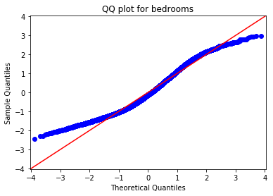


_(See the project notebook in this repository for a full printout of the Q-Q plots.)_

My residuals definitely aren't perfectly normal, but they aren't too bad for some of the features, like `bedrooms`, `bathrooms`, `sqft_living`, and `grade`. Although there is plenty of room for improvement in my model (and lots that it _can't_ explain, simply because the original data are limited), I think it is worth proceeding to the validation stage with this model.

# Validating the model

To ensure that my model could be used to generalize to houses outside my dataset, I will validate it using k-fold cross-validation. Because I am going to use a function from Scikit-Learn for validation, I will first duplicate my model in Scikit-Learn to make things a little easier.


```python
# Import needed sklearn packages
from sklearn.linear_model import LinearRegression
from sklearn.metrics import mean_squared_error
from sklearn.model_selection import cross_val_score

# Initialize and run the regression model using sklearn
linreg = LinearRegression()
linreg.fit(mh_selected, mh_zips_encoded['price'])
```


    LinearRegression(copy_X=True, fit_intercept=True, n_jobs=None, normalize=False)


```python
# Define a function to call cross_val_score for various k values
def crossval_it(model, features, target, k):
    
    """Find mean of MSE for k folds in cross-validation
    model: your linear model, preferably a LinearRegression() object
    features: a DataFrame of just your features
    target: a DataFrame of just your target
    k: number of folds for cross-validation
    Dependencies: numpy, sklearn.metrics.mean_squared_error, 
    sklearn.metrics.cross_val_score"""
    
    result = np.mean(cross_val_score(model, features, target, cv=k, 
                                      scoring='neg_mean_squared_error'))
    return result
```


```python
# Define a function to compare k-fold cross-validation results at various
# values of k
def compare_k_folds(model, features, target, folds_list):
    
    """Print MSE for k-fold cross-validation with various k values
    model: your linear model, preferably a LinearRegression() object
    features: a DataFrame of just your features
    target: a DataFrame of just your target
    folds_list: a list of numbers of folds (k) to use in cross-
    validation
    Dependencies: numpy, sklearn.metrics.mean_squared_error, 
    sklearn.metrics.cross_val_score"""
    
    for fold in folds_list:
        mean_mse = crossval_it(model, features, target, fold)
        
        print('{} folds: {}'.format(fold, mean_mse))
```


```python
# Call compare_k_folds for 5, 10, and 20 folds
folds = [5, 10, 20]

compare_k_folds(linreg, mh_selected, mh_zips_encoded['price'], folds)
```

    5 folds: -5729117966.714569
    
    10 folds: -5722862137.233953
    
    20 folds: -5698285685.955608


The results for 5, 10, and 20-fold cross-validation above are mean squared errors. Taking the square root of each of these (root mean squared error or RMSE), I can see that, while my model doesn't predict price perfectly, at least it is pretty consistent. 


```python
# Define a function to compare RMSE for k-fold cross-validation at
# various k values
def compare_rmse(model, features, target, folds_list):
    
    """Compare RMSE for k-fold cross-validation results at various k values
    model: your linear model, preferably a LinearRegression() object
    features: a DataFrame of just your features
    target: a DataFrame of just your target
    folds_list: a list of numbers of folds (k) to use in cross-
    validation
    Dependencies: numpy, sklearn.metrics.mean_squared_error, 
    sklearn.metrics.cross_val_score"""
    
    for fold in folds_list:
        rmse = np.sqrt(abs(crossval_it(model, features, target, fold)))
        print('{} folds: {}'.format(fold, rmse))
```


```python
# Call compare_rmse for 5, 10, and 20 folds
compare_rmse(linreg, mh_selected, mh_zips_encoded['price'], folds)
```

    5 folds: 75690.9371504579
    
    10 folds: 75649.60103816776
    
    20 folds: 75486.99017682191


The benefit to looking at RMSE is that is it in the same units as the target; since our target is price and it hasn't been transformed in any way, RMSE can be expressed in dollars. As we cross-validate with more and more folds, RMSE stays pretty consistent, varying by only \$204 from 5 to 20 folds. From this validation process I conclude that, although my model doesn't explain all the variation in price, it does its job consistently; its successes are not all random or lucky.

In the "Interpretation" section below, I will wrap up with a summary of how my model can help middle-income families understand the factors that influence the price of a home they want to buy or sell.

# Interpretation

My purpose in analyzing the King County Housing dataset was to extract insights that would help middle-income families understand the factors influencing the prices of homes they want to buy or sell. 

From the original dataset I eliminated the top 10% most expensive homes and then selected only homes with two to five bedrooms. This filtering left 18,999 observations for my analysis, with a median home price of \$425,000, an affordable price for a family earning King County's median household income.

Examining a few features in isolation, I was able to observe the following:

* The time of year may have an impact on sale price. Median sale prices in the months of April, May, June, and July tend to be higher than those at other times of year. For instance, April's median home price is \$41,000 higher than January's.

* The number of bedrooms may be a good indicator of sale price, and adding a bedroom could cause a substantial increase in the sale price of a home. For instance, adding a fourth bedroom to a three-bedroom house could cause up to a 22% increase in sale price.

* Similarly, improving the grade of a house could have a substantial impact on price. For instance, raising a house's grade from 7 to 8 could raise the sale price by over \$126,000.

It is important to note that the above observations are based on considering features in isolation, but in reality, the features in this dataset are probably related to one another in ways that affect the target (price). For instance, adding a bedroom probably means increasing a home's square footage at the same time, and if a new addition improves the design of the home, the grade may also increase. 

My multiple linear regression model can offer more precise insights on the impacts of various features on price. I fit the model to a version of my dataset that used one-hot encoding on zipcodes, and I used stepwise feature selection to eliminate features that were not having a significant impact on price. The resulting model explains 82\% of the variability in price. 

Specifically, the model coefficients show that:

* Adding a bathroom or increasing square footage by 100 square feet could raise the price of a home by over \$8,300.

* Improving the condition of a home by one level (e.g., from 3 to 4) could raise the price of the home by over \$21,000.

* Improving the grade of a home by one level (e.g., from 7 to 8) could raise the price of the home by over \$42,000.

The dollar values cited here are likely to be much more accurate than those above because they take into account the effects of many features on price, not just one at a time. 

There are many factors influencing the price of a home, not all of which are within a homeowner's control. There are also many potential factors affecting price that the original dataset did not consider, such as a home's school district, or the walkability of the neighborhood, or the distance to major employment centers. My model indicates, however, that there are some concrete steps a homeowner can take to raise the potential sale price of a home, including improvements to amenities and design.

# Appendix

## Project repository

This repository (github.com/jrkreiger/fs-project-1)[https://github.com/jrkreiger/fs-project-1] contains files from a project assigned to me as part of Flatiron School's Online Data Science Bootcamp. The purpose of the project was to demonstrate skills in data cleaning and multiple linear regression modeling.

Here's what you'll find inside:

* **pricing-midrange-homes-king-co-wa.ipynb**: Jupyter Notebook containing project code

* **column_names.md**: Markdown file containing the data dictionary for the dataset provided by Flatiron School

* **kc_house_data.csv**: CSV file containing the dataset provided by Flatiron School

* **presentation.pdf**: PDF file containing slides from a non-technical presentation of project results

## Technical specifications

I created the Jupyter Notebook in a virtual environment provided to me by Flatiron School. Things may work a little differently for you if you're running different versions of Python or the packages I used.

If you download the notebook to view locally, note that I formatted it using Jupyter Notebook extensions (https://github.com/ipython-contrib/jupyter_contrib_nbextensions). The extensions let me easily create a table of contents and collapse groups of cells to make the notebook easier to read and navigate. If you don't have the extensions installed locally, the notebook will look a little different for you.

## Related content

You can read my blog post about the project at this link: http://jrkreiger.net/uncategorized/cleaning-house-data/.

View a video of my non-technical presentation here: https://youtu.be/yvaGRdNtPNI.

## Authorship

Flatiron School provided me the dataset, the data dictionary, a Jupyter Notebook containing only a rubric for recording my identifying information, and the code I used for stepwise selection. I wrote the rest of the code in the Jupyter Notebook, the text of this README, my blog post linked above, and the content of my non-technical presentation (with the exception of some images whose creators I credit in the slides).
